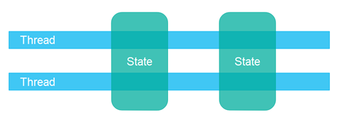
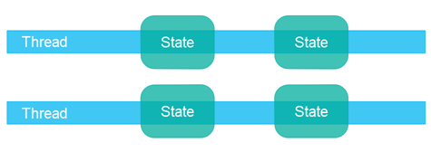
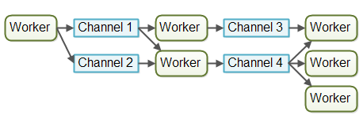

# 并发模型

并发系统可以使用不同的**并发模型**实现。一个**并发模型**指定了系统中的线程如何协作以完成它们被赋予的任务。不同的并发模型以不同的方式分割任务，线程之间的通信和协作方式也可能不同。本并发模型教程将更深入地探讨在撰写本文时（2015 - 2019）最流行的并发模型。

## 并发模型与分布式系统的相似之处

本文中描述的并发模型类似于分布式系统中使用的不同架构。在并发系统中，不同的线程相互通信。在分布式系统中，不同的过程（可能在不同的计算机上）相互通信。线程和进程在性质上非常相似。这就是为什么不同的并发模型通常看起来类似于不同的分布式系统架构。

当然，分布式系统有一个额外的挑战，即网络可能会失败，或者远程计算机或进程可能会宕机等。但是，如果一个CPU失败、网络卡失败、磁盘失败等，运行在大型服务器上的并发系统可能会遇到类似的问题。故障的可能性可能较低，但理论上仍然可能发生。

因为并发模型类似于分布式系统架构，它们通常可以互相借鉴思路。例如，用于在工作线程（线程）之间分配工作模型通常类似于分布式系统中的负载均衡模型。日志记录、故障转移、任务的幂等性等错误处理技术也是如此。

## 共享状态与独立状态

并发模型的一个重要方面是，组件和线程是设计为在线程之间共享状态，还是拥有独立的、从不在线程之间共享的状态。

_共享状态_意味着系统中的不同线程将共享它们之间的某些状态。所谓_状态_是指某些数据，通常是一个个对象或类似的内容。当线程共享状态时，可能会出现诸如竞态条件和死锁等问题。当然，这取决于线程如何使用和访问共享对象。



_独立状态_意味着系统中的不同线程不共享任何状态。如果不同的线程需要通信，它们可以通过交换不可变对象，或者通过发送对象（或数据）的副本来进行。因此，当没有两个线程写入同一个对象（数据/状态）时，你可以避免大多数常见的并发问题。



使用独立状态并发设计通常可以使代码的某些部分更容易实现，更容易推理，因为你知道只有一个线程将永远写入给定的对象。你不必担心对该对象的并发访问。然而，你可能需要更多地考虑在大局中应用设计，以使用独立状态并发。不过，我觉得这是值得的。我个人更喜欢独立状态并发设计。

## 并行工作

第一个并发模型是我所说的_并行工作_模型。传入的工作被分配给不同的工作者。下面是一个图示，说明了并行工作并发模型：


在并行工作并发模型中，委派者将传入的工作分配给不同的工作者。每个工作者完成全部工作。工作者并行工作，在不同的线程中运行，可能在不同的CPU上。

如果并行工作模型在汽车工厂中实现，每辆汽车将由一个工人生产。工人会得到要建造的汽车的规格，并从头到尾建造一切。

并行工作并发模型是Java应用程序中最常用的并发模型（尽管这种情况正在改变）。java.util.concurrent Java包中的许多并发实用程序都是为这种模型设计的。你还可以在日本企业版应用程序服务器的设计中看到这种模型的痕迹。

并行工作并发模型可以设计为使用共享状态或独立状态，这意味着工作者要么可以访问一些共享状态（共享对象或数据），要么他们没有共享状态。

## 并行工作的优势

并行工作并发模型的优势在于它易于理解。要增加应用程序的并行级别，你只需添加更多的工作者。

例如，如果你正在实现一个网络爬虫，你可以使用不同数量的工作者爬取一定数量的页面，并看看哪个数字提供了最短的总爬取时间（即最高性能）。由于网络爬取是一个IO密集型工作，你可能会在计算机的每个CPU/核心上最终得到几个线程。每个CPU一个线程太少了，因为它在等待数据下载的大部分时间里都会处于空闲状态。

## 并行工作的劣势

然而，并行工作并发模型也有一些潜在的劣势。我将在以下部分中解释最明显的劣势。

### 共享状态可能变得复杂

如果共享工作者需要访问某种共享数据，无论是在内存中还是在共享数据库中，管理正确的并发访问可能会变得复杂。下图显示了这如何使并行工作并发模型复杂化：


其中一些共享状态在通信机制中，如作业队列。但是，其中一些共享状态是业务数据、数据缓存、数据库连接池等。

一旦共享状态潜入并行工作并发模型，它就开始变得复杂。线程需要以一种确保一个线程所做的更改对其他线程可见的方式访问共享数据（推入主内存，而不仅仅是停留在执行线程的CPU缓存中）。

线程需要避免竞态条件、死锁和许多其他共享状态并发问题。

此外，当线程在访问共享数据结构时相互等待时，部分并行化就丢失了。许多并发数据结构是阻塞的，意味着在任何给定时间，只有一个或有限数量的线程可以访问它们。这可能导致对这些共享数据结构的争用。高争用将导致执行部分代码的序列化程度（消除并行化），这些代码访问共享数据结构。

现代非阻塞并发算法可能会减少争用并提高性能，但非阻塞算法很难实现。

持久数据结构是另一种选择。持久数据结构在修改时总是保留其自身的先前版本。因此，如果多个线程指向相同的持久数据结构，而一个线程修改它，修改线程将获得对新结构的引用。所有其他线程仍然保持对旧结构的引用，该结构仍未更改，因此是一致的。Scala标准API包含几个持久数据结构。

虽然持久数据结构是解决共享数据结构并发修改的优雅解决方案，但持久数据结构往往性能不佳。

例如，持久列表将把所有新元素添加到列表的头部，并返回对新添加元素的引用（然后指向列表的其余部分）。所有其他线程仍然保持对列表中第一个元素的引用，对这些线程来说，列表看起来没有变化。它们看不到新添加的元素。

这样一个持久列表被实现为链表。不幸的是，链表在现代硬件上的性能表现不佳。列表中的每个元素都是一个单独的对象，这些对象可以分散在整个计算机的内存中。现代CPU在顺序访问数据时速度快得多，所以在现代硬件上，你会从基于数组的列表实现中获得更高的性能。数组按顺序存储数据。CPU缓存可以一次加载数组的大块数据到缓存中，并在加载后直接在CPU缓存中访问数据。这在链表中是不可能的，因为元素分散在RAM中。

### 无状态工作者

共享状态可以被系统中的其他线程修改。因此，工作者每次需要它时都必须重新读取状态，以确保他们正在处理最新副本。这无论共享状态是存储在内存中还是在外部数据库中都是如此。不保留内部状态（但每次需要时重新读取）的工作者被称为**无状态**。

每次需要时重新读取数据可能会变慢。特别是如果状态存储在外部数据库中。

### 作业排序不确定

并行工作者模型的另一个劣势是作业执行顺序不确定。没有办法保证哪些作业先执行或最后执行。作业A可能在作业B之前交给工作者，但作业B可能在作业A之前执行。

并行工作者模型的不确定性质使其难以在任何给定时间推理系统的当前状态。此外，它也使得（如果不是不可能的话）更难（如果不是不可能的话）保证一个任务在另一个任务之前完成。这并不总是导致问题。这取决于系统的需求。

## 流水线

第二个并发模型是我所称的**流水线**并发模型。我选择这个名字只是为了与前面**并行工作者**的隐喻相适应。其他开发人员根据平台/社区使用其他名称（例如响应式系统或事件驱动系统）。下面是一个图示，说明了流水线并发模型：


工作者被组织成像工厂装配线上的工作者。每个工作者只执行全部工作的一小部分。当这部分完成时，工作者将工作转发给下一个工作者。

使用流水线并发模型的系统通常被设计为使用非阻塞IO。非阻塞IO意味着当一个工作者启动一个IO操作（例如读取文件或从网络连接读取数据）时，工作者不会等待IO调用完成。IO操作很慢，所以等待IO操作完成是浪费CPU时间。与此同时，CPU可以做其他事情。当IO操作完成时，IO操作的结果（例如读取的数据或写入数据的状态）被传递给另一个工作者。

使用非阻塞IO，IO操作确定工作者之间的边界。一个工作者尽可能多地执行，直到它必须启动一个IO操作。然后它放弃对工作的控制。当IO操作完成时，流水线上的下一个工作者继续处理工作，直到它也必须启动一个IO操作等。


实际上，作业可能不会沿着一条流水线流动。由于大多数系统可以执行多个作业，作业根据需要执行的作业部分流向工作者。实际上，可能同时运行多个不同的虚拟流水线。这就是流水线系统中作业流程可能在现实中的样子：


作业甚至可能被转发给多个工作者进行并行处理。例如，一个作业可能同时被转发给作业执行者和作业记录器。下图说明了所有三条流水线如何通过将它们的作业转发给同一个工作者（中间流水线的最后一个工作者）来完成：


流水线可能比这更复杂。

### 响应式、事件驱动系统

使用流水线并发模型的系统有时也被称为**响应式系统**或**事件驱动系统**。系统的工作者对系统中发生的事件做出反应，无论是来自外部世界的还是由其他工作者发出的。事件的例子可能是传入的HTTP请求，或者某个文件完成加载到内存中等。

在撰写本文时，有许多有趣的响应式/事件驱动平台可用，未来还会有更多。一些更受欢迎的似乎包括：

- Vert.x
- Akka
- Node.JS (JavaScript)

我个人发现Vert.x相当有趣（特别是对于像我这样的Java/JVM老手）。

### 参与者与通道

参与者和通道是流水线（或响应式/事件驱动）模型的两个类似的例子。

在参与者模型中，每个工作者被称为_参与者_。参与者可以互相直接发送消息。消息是异步发送和处理的。参与者可以用来实现一个或多个作业处理流水线，如前所述。下面是一个图示，说明了参与者模型：


在通道模型中，工作者不直接相互通信。相反，它们在不同的通道上发布它们的信息（事件）。其他工作者可以在不知道谁是监听者的情况下监听这些通道上的消息。下面是一个图示，说明了通道模型：



在撰写本文时，通道模型对我来说似乎更灵活。工作者不需要知道后续在流水线中处理作业的工作者是什么。它只需要知道将作业转发到哪个通道（或发送消息等）。通道上的监听器可以订阅和取消订阅，而不影响写入通道的工作者。这允许工作者之间的耦合更松散。

## 流水线的优势

流水线并发模型与并行工作模型相比有几个优势。我将在以下部分中介绍最大的优势。

### 无共享状态

工作者与其他工作者不共享状态意味着它们可以不经过考虑所有可能因并发访问共享状态而产生的并发问题来实现。这使得实现工作者变得更加容易。你实现一个工作者就好像它是唯一执行该工作的线程 - 基本上是一种单线程实现。

### 有状态的工作者

由于工作者知道没有其他线程会修改它们的数据，工作者可以是有状态的。通过有状态，我指的是它们可以在内存中保留它们需要操作的数据，只将更改写回最终的外部存储系统。因此，有状态的工作者通常可以比无状态的工作者更快。

### 更好的硬件一致性

单线程代码的优势在于它通常更好地符合底层硬件的工作方式。

首先，当你可以假设代码以单线程模式执行时，你通常可以创建更优化的数据结构和算法。

其次，如上所述，单线程有状态工作者可以在内存中缓存数据。当数据在内存中缓存时，也有更高的概率这些数据也缓存在执行线程的CPU缓存中。这使得访问缓存数据更快。

当代码以一种自然受益于底层硬件工作方式的方式编写时，我称之为_硬件一致性_。一些开发人员称之为_机械同情_。我更喜欢硬件一致性这个词，因为计算机几乎没有机械部件，而且"同情"这个词在这个上下文中用作"更好地匹配"的隐喻，我认为"conform"这个词很好地传达了。无论如何，这是吹毛求疵。使用你更喜欢的任何术语。

### 作业排序是可能的

可以按照流水线并发模型实现并发系统，以保证作业排序。作业排序使得在任何给定时间推理系统的当前状态变得更加容易。此外，你可以将所有传入的作业写入日志。然后，如果系统的任何部分失败，可以使用这个日志来从头开始重建系统的状态。作业以一定的顺序写入日志，这个顺序就成为了保证的作业顺序。下面是这种设计可能的样子：


实现保证的作业排序并不一定容易，但通常可能。如果可以做到，它极大地简化了备份、恢复数据、复制数据等任务，因为所有这些都可以通过对日志文件进行操作来完成。

## 流水线的劣势

流水线并发模型的主要劣势是作业的执行经常分散在多个工作者身上，因此也分散在项目中的多个类中。因此，很难确切地看到给定作业正在执行的代码是什么。

编写代码也可能更加困难。工作者代码有时被编写为回调处理程序。有许多嵌套回调处理程序的代码可能会导致一些开发人员所说的_回调地狱_。回调地狱意味着很难跟踪代码实际上在做什么，以及确保每个回调都能访问到它需要的数据。

在并行工作并发模型中，这往往更容易。你可以打开工作者代码并从开始到结束阅读执行的代码。当然，并行工作者代码也可能分散在许多不同的类中，但执行顺序通常更容易从代码中读取。

## 功能性并行

功能性并行是第三种并发模型，最近（2015年）被广泛讨论。

功能性并行的基本思想是使用函数调用来实现你的程序。函数可以被看作是“代理”或“参与者”，它们像流水线并发模型（即响应式或事件驱动系统）中一样互相发送消息。当一个函数调用另一个函数时，这类似于发送消息。

所有传递给函数的参数都被复制，所以没有实体可以操纵外部接收函数的数据。这种复制对于避免共享数据上的竞态条件至关重要。这使得函数执行类似于原子操作。每个函数调用可以独立于任何其他函数调用执行。

当每个函数调用可以独立执行时，每个函数调用可以在单独的CPU上执行。这意味着，用函数实现的算法可以在多个CPU上并行执行。

有了Java 7，我们得到了`java.util.concurrent`包，其中包含ForkAndJoinPool，它可以帮助实现类似于功能性并行的东西。有了Java 8，我们得到了可以并行迭代大型集合的并行流。请记住，有些开发人员对`ForkAndJoinPool`持批评态度（你可以在我的`ForkAndJoinPool`教程中找到批评链接）。

功能性并行的难点在于知道哪些函数调用要并行化。跨CPU协调函数调用带来了开销。由函数完成的工作单位需要达到一定大小才值得这个开销。如果函数调用非常小，尝试并行化它们实际上可能比单线程、单CPU执行更慢。

据我理解（我的了解并不完美），你可以使用响应式、事件驱动模型实现算法，并实现类似于功能性并行的工作分解。使用事件驱动模型，你只是获得了更多对并行化什么和并行化多少的控制（在我看来）。

此外，如果任务是程序唯一正在执行的任务，那么在多个CPU上分割任务时产生的开销才有意义。然而，如果系统同时执行多个其他任务（如Web服务器、数据库服务器等），那么尝试并行化单个任务是没有意义的。计算机中的其他CPU无论如何都会忙于处理其他任务，因此没有理由用一个更慢的功能性并行任务来干扰它们。你最好使用流水线（响应式）并发模型，因为它的开销更小（在单线程模式下顺序执行）并且更好地符合底层硬件的工作方式。

## 哪种并发模型最好？

那么，哪种并发模型更好？

正如通常情况一样，答案是这取决于你的系统应该做什么。如果你的工作天然是并行的、独立的，没有必要的共享状态，你可能可以使用并行工作模型实现你的系统。

然而，许多工作并不是天然并行和独立的。对于这些类型的系统，我认为流水线并发模型比并行工作模型有更多的优势。

你甚至不必自己编写所有那些流水线基础设施。像Vert.x这样的现代平台已经为你实现了很多。个人而言，我将探索在像Vert.x这样的平台上运行的设计，用于我的下一个项目。Java EE再也没有优势了，我感觉。
```


