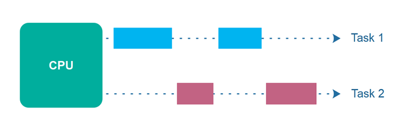

# 并发与并行：对比教程

_并发_和_并行_这两个术语经常与多线程程序相关联。
起初，它们看起来可能指的是相同的概念，但实际上，并发和并行具有不同的含义。在本并发与并行教程中，我将解释这些概念的含义。

仅此声明，在本文中，我将讨论的是单个应用程序 - 单个进程内的并发和并行，而不是多个应用程序、进程或计算机之间的情况。

## 并发

_并发_ 意味着一个应用程序同时或至少看似同时（并发地）在多个任务上取得进展。

如果计算机只有一个CPU，应用程序可能无法_完全同时_在多个任务上取得进展，但应用程序内同时有多个任务正在进行中。
要使多个任务并发取得进展，CPU在执行过程中在不同任务之间切换。这在下图中进行了说明：

## 并行执行

并行执行是指计算机拥有多个CPU或CPU核心，并同时在多个任务上取得进展。然而，并行执行并不指代与_并行性_相同的现象。我稍后将回到并行性的话题。并行执行在下图中进行了说明：

## 并行并发执行

可以进行并行并发执行，其中线程分布在多个CPU上。因此，在同一个CPU上执行的线程是并发执行的，而在不同CPU上执行的线程是并行执行的。下图说明了并行并发执行。

## 并行性

术语_并行性_意味着应用程序将其任务分解为可以并行处理的较小子任务，例如在同一时间在多个CPU上。因此，并行性并不指代与并行并发执行相同的执行模型 - 即使它们在表面上看起来可能相似。

要实现真正的并行性，应用程序必须有多个线程在运行 - 并且每个线程必须在单独的CPU/CPU核心/显卡GPU核心或类似的设备上运行。

下图说明了一个大任务被分解为4个子任务。这4个子任务由4个不同的线程执行，这些线程在2个不同的CPU上运行。这意味着，这些子任务的部分是并发执行的（在同一个CPU上执行的部分），而部分是并行执行的（在不同CPU上执行的部分）。

如果这4个子任务由每个自己的CPU上运行的4个线程执行（总共4个CPU），那么任务执行将完全并行。然而，并不总是容易将一个任务分解为与可用CPU数量完全相同的子任务数量。通常，更容易将一个任务分解为与手头任务自然适应的子任务数量，然后让线程调度器负责在可用CPU之间分配线程。

## 并发和并行组合

总结一下，并发指的是单个CPU如何同时在多个任务上取得进展（也就是并发地）。

而并行性则与应用程序如何将单个任务的执行并行化有关 - 通常通过将任务分解为可以并行完成的子任务。

这两种执行风格可以在同一应用程序中结合使用。我将在下面介绍其中的一些组合。

### 并发，非并行

应用程序可以是并发的，但不是并行的。这意味着它同时在多个任务上取得进展（并发地），但应用程序在每个任务上取得进展时会进行切换 - 直到任务完成。没有真正的并行任务执行在并行线程/CPU中。

### 并行，非并发

应用程序也可以是并行的，但不是并发的。这意味着应用程序一次只处理一个任务，并且这个任务被分解为可以并行处理的子任务。然而，在下一个任务被分解并并行执行之前，每个任务（+子任务）都完成了。

### 既非并发也非并行

此外，应用程序既不是并发的，也不是并行的。这意味着它一次只处理一个任务，并且该任务从未被分解为用于并行执行的子任务。对于只有单一工作的小型命令行应用程序，这可能是情况，因为它只有一项工作，这项工作太小，没有并行化的意义。

### 既并发又并行

最后，应用程序也可以以两种方式既并发又并行：

第一种是简单的并行并发执行。如果一个应用程序启动了多个线程，然后这些线程在多个CPU上执行，就会发生这种情况。

第二种方式是应用程序同时处理多个任务，并发地，并且也将每个任务分解为用于并行执行的子任务。然而，在这种情况下，可能会失去并发和并行的一些好处，因为计算机中的CPU已经通过并发或并行单独保持了合理的忙碌。结合使用可能导致性能提升很小，甚至性能下降。在盲目采用并发并行模型之前，请确保进行分析和测量。

