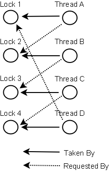

# 死锁预防

在某些情况下，可以预防死锁。本文将描述三种技术：

1. 锁排序
2. 锁超时
3. 死锁检测

## GitHub代码仓库

您可以在以下GitHub仓库中查看本教程讨论的解决方案的代码示例（至少在视频中讨论过）：

[java-examples GitHub仓库](https://github.com/jjenkov/java-examples)

## 锁排序

当多个线程需要相同的锁但以不同顺序获取它们时，会发生死锁。

如果确保所有线程总是以相同的顺序获取所有锁，就不会发生死锁。看这个例子：

```plaintext
Thread 1:
  锁定 A
  锁定 B

Thread 2:
  等待 A
  当 A 锁定后锁定 C

Thread 3:
  等待 A
  等待 B
  等待 C
```

如果一个线程（如Thread 3）需要多个锁，它必须按照决定的顺序获取它们。它不能在获取了早期锁之后才获取后续的锁。

例如，Thread 2或Thread 3在锁定A之前都不能锁定C。由于Thread 1持有锁A，Thread 2和3必须首先等待锁A被解锁。然后它们必须成功锁定A，然后才能尝试锁定B或C。

锁排序是一种简单但有效的死锁预防机制。然而，只有在获取任何锁之前知道所有需要的锁时才能使用它。情况并不总是这样。

## 锁超时

另一种死锁预防机制是对锁尝试设置超时，意味着尝试获取锁的线程只会尝试一段时间然后放弃。如果线程在给定超时内没有成功获取所有必要的锁，它将回退，释放所有已获取的锁，等待随机时间然后重试。等待的随机时间可以给其他尝试获取相同锁的线程一个机会来获取所有锁，从而使应用程序继续运行而不会锁定。

以下是两个线程尝试以不同顺序获取两个相同锁的示例，其中线程回退并重试：

```plaintext
Thread 1 锁定 A
Thread 2 锁定 B

Thread 1 尝试锁定 B 但被阻塞
Thread 2 尝试锁定 A 但被阻塞

Thread 1 对 B 的锁尝试超时
Thread 1 回退并释放 A
Thread 1 在重试前随机等待（例如257毫秒）

Thread 2 对 A 的锁尝试超时
Thread 2 回退并释放 B
Thread 2 在重试前随机等待（例如43毫秒）
```

在上面的例子中，Thread 2将在Thread 1之前大约200毫秒重试获取锁，因此很可能会成功获取两个锁。然后Thread 1将等待已经尝试获取的锁A。当Thread 2完成后，Thread 1也将能够获取两个锁（除非Thread 2或另一个线程在此期间获取了锁）。

需要注意的一个问题是，仅仅因为锁超时，并不一定意味着线程已经死锁了。这也可能意味着持有锁的线程（导致其他线程超时）需要很长时间来完成其任务。

此外，如果足够多的线程竞争相同的资源，即使超时并回退，它们仍然有可能一次又一次地尝试同时获取线程。这可能不会在两个线程每个在重试前等待0到500毫秒的情况下发生，但有10或20个线程情况就不同了。那么两个线程等待相同的时间（或足够接近以引起问题）然后再试的可能性要大得多。

锁超时机制的一个问题是，在Java中不可能为进入同步块设置超时。您将不得不创建自定义锁类或使用Java 5并发构造中的一个在`java.util.concurrent`包中。编写自定义锁并不难，但这不是本文的范围。后续的Java并发教程将涵盖自定义锁。

## 死锁检测

死锁检测是一种更重的死锁预防机制，旨在用于锁排序不可能，锁超时也不可行的情况。

每次线程**获取**锁时，都会在线程和锁的数据结构（映射、图等）中记录。

此外，每当线程**请求**锁时，也会在该数据结构中记录。

当线程请求锁但请求被拒绝时，线程可以遍历锁图以检查死锁。例如，如果线程A请求锁7，但锁7由线程B持有，那么线程A可以检查线程B是否请求了线程A持有的任何锁（如果有）。如果线程B请求了，那么死锁就发生了（线程A获取了锁1，请求锁7，线程B获取了锁7，请求锁1）。

当然，死锁场景可能比两个线程持有彼此的锁要复杂得多。
线程A可能等待线程B，线程B等待线程C，线程C等待线程D，线程D等待线程A。为了检测死锁，线程A必须转而检查线程B请求的所有锁。从线程B请求的锁中，线程A将找到线程C，然后是线程D，从中它找到了线程A本身持有的锁之一。然后它就知道死锁已经发生了。

下面是一个由4个线程（A、B、C和D）获取和请求的锁的图。可以使用这样的数据结构来检测死锁。



那么，如果检测到死锁，线程会怎么做呢？

一种可能的操作是释放所有锁，回退，等待随机时间然后重试。这类似于简单的锁超时机制，只是线程在实际发生死锁时才回退。而不仅仅是因为它们的锁请求超时了。然而，如果很多线程竞争相同的锁，即使它们回退并等待，它们也可能反复陷入死锁。

一个更好的选择是确定或分配线程的优先级，以便只有一个（或几个）线程回退。其余的线程继续获取它们需要的锁，就好像没有发生死锁一样。如果分配给线程的优先级是固定的，那么相同的线程将始终获得更高的优先级。为了避免这种情况，您可以在每次检测到死锁时随机分配优先级。

