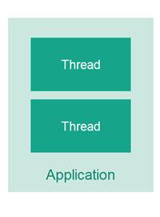
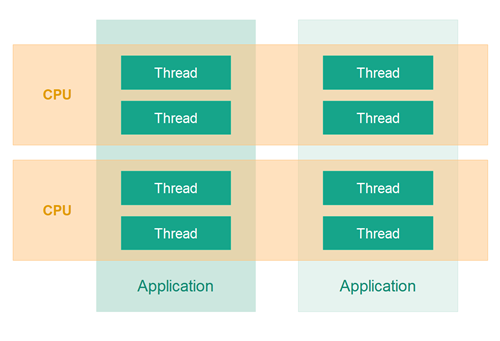

# Java并发和多线程

Java **并发**是一个涵盖Java平台上多线程、并发和并行的术语。这包括Java并发工具、问题和解决方案。本Java并发教程系列涵盖了Java中多线程的核心概念、并发构造、并发问题、成本和与多线程相关的好处。

Java中的并发和多线程特性不断发展。最新的增加是Java虚拟线程和结构化并发。因此，请确保定期回来查看新内容。

## Java并发教程视频
如果您更喜欢视频，我有一个视频播放列表，涵盖了与本教程系列相同的一些主题。您可以在此处找到视频播放列表：
Java Concurrency & Multithreading - Video Playlist

## 什么是多线程？
多线程意味着在同一个应用程序中拥有多个**执行线程**。
一个线程就像一个单独的CPU执行您的应用程序。因此，一个多线程应用程序就像一个有多个CPU同时执行代码的不同部分的应用程序。

一个线程并不等同于一个CPU。通常，一个CPU将在多个线程之间共享其执行时间，轮流执行每个线程一段给定的时间。应用程序的线程也可以由不同的CPU执行。

## 为什么使用多线程？
使用应用程序中的多线程有几个原因。多线程最常见的原因包括：

- 更好地利用单个CPU。
- 更好地利用多个CPU或CPU核心。
- 提高响应性的用户体验。
- 提高公平性的用户体验。

我将在以下部分中更详细地解释每个原因。

### 更好地利用单个CPU
一个最常见的原因是能够更好地利用计算机中的资源。例如，如果一个线程正在等待通过网络发送的请求的响应，那么另一个线程可以同时使用CPU做其他事情。此外，如果计算机有多个CPU，或者CPU有多个执行核心，那么多线程也可以帮助应用程序利用这些额外的CPU核心。

### 更好地利用多个CPU或CPU核心
如果计算机包含多个CPU或者CPU包含多个执行核心，那么您需要使用多个线程才能使应用程序能够利用所有的CPU或CPU核心。一个单一的线程最多只能利用一个CPU，如我上面提到的，有时甚至不能完全利用一个CPU。

### 提高响应性的用户体验
使用多线程的另一个原因是提供更好的用户体验。例如，如果您在GUI上点击一个按钮，这导致通过网络发送一个请求，那么执行这个请求的线程是哪个就很重要。如果您使用同一个线程来更新GUI，那么当GUI线程等待请求的响应时，用户可能会体验到GUI“挂起”。相反，这样的请求可以由一个后台线程执行，这样GUI线程就可以同时响应其他用户请求。

### 提高公平性的用户体验
第四个原因是在用户之间更公平地共享计算机资源。例如，想象一个服务器接收来自客户端的请求，但只有一个线程来执行这些请求。如果一个客户端发送了一个需要长时间处理的请求，那么所有其他客户端的请求将不得不等待那个请求完成。通过让每个客户端的请求由自己的线程执行，那么没有任何单一任务可以完全独占CPU。

## 多线程与多任务
在早期，计算机只有一个CPU，只能一次执行一个程序。大多数小型计算机实际上没有足够的能力同时执行多个程序，所以没有尝试过。公平地说，许多大型机系统多年来一直能够同时执行多个程序，比个人电脑要长得多。

### 多任务
后来出现了多任务，这意味着计算机可以同时执行多个程序（也称为任务或进程）。但实际上并不是“同时”。单个CPU在程序之间共享。操作系统会在运行的程序之间切换，每个程序执行一小段时间后切换。

随着多任务的出现，软件开发人员面临了新的挑战。程序不能再假设拥有所有可用的CPU时间，也不能假设拥有所有内存或其他任何计算机资源。一个“好公民”程序应该释放它不再使用的所有必要资源，以便其他程序可以使用它们。

### 多线程
再后来出现了多线程，这意味着你可以在同一个程序中有多个执行线程。一个执行线程可以被看作是CPU执行程序。当你有多个线程执行同一个程序时，就像在同一个程序内有多个CPU执行。

## 多线程是困难的
多线程可以是提高某些类型程序性能的绝佳方式。然而，多线程甚至比多任务更具挑战性。线程在同一个程序内执行，因此它们同时读写相同的内存。这可能导致在单线程程序中看不到的错误。其中一些错误可能在单CPU机器上看不到，因为两个线程从来没有真正的“同时”执行。然而，现代计算机配备了多核CPU，甚至有多个CPU。这意味着不同的线程可以由不同的核心或CPU同时执行。

如果一个线程在另一个线程写入时读取一个内存位置，第一个线程最终将读取什么值？旧值？第二个线程写的值？两者之间的混合值？或者，如果两个线程同时写入同一个内存位置，它们完成后将留下什么值？第一个线程写的值？第二个线程写的值？还是两者写的混合值？

如果不采取适当的预防措施，所有这些结果都是可能的。这种行为甚至不可预测。结果可能会不时改变。因此，作为开发人员，了解如何采取正确的预防措施是重要的 - 这意味着学习如何控制线程如何访问共享资源，如内存、文件、数据库等。这是本Java并发教程涉及的主题之一。

## Java中的多线程和并发
Java是最早使多线程对开发人员易于使用的语言之一。Java从一开始就具备多线程能力。因此，Java开发人员经常面临上述问题。这就是我写这篇关于Java并发的文章的原因。作为给自己的笔记，以及任何可能从中受益的Java开发人员。

这篇文章主要关注Java中的多线程，但多线程中出现的一些问题与多任务和分布式系统中出现的问题类似。因此，多任务和分布式系统的引用也可能出现在这篇文章中。因此，使用了“并发”这个词，而不是“多线程”。

## 并发模型
第一种Java并发模型假设在同一个应用程序中执行的多个线程也会共享对象。这种类型的并发模型通常被称为“共享状态并发模型”。
许多并发语言构造和实用程序旨在支持这种并发模型。

然而，自从第一本Java并发书籍编写以来，甚至自从Java 5并发实用程序发布以来，在并发架构和设计领域发生了很多事情。

共享状态并发模型导致了很多并发问题，这些问题可能很难优雅地解决。
因此，一种被称为“共享无”或“独立状态”的替代并发模型已经变得流行。在独立状态并发模型中，线程不共享任何对象或数据。这避免了共享状态并发模型的许多并发访问问题。

新的异步“独立状态”平台和工具包如Netty、Vert.x和Play/Akka和Qbit已经出现。
已经发布了新的非阻塞并发算法，并添加了新的非阻塞工具，如LMax Disrupter。新的函数式编程并行性已经通过Java 7中的Fork和Join框架以及Java 8中的集合流API引入。

随着所有这些新的发展，是时候更新我的Java并发教程了。因此，本教程再次是**进行中的工作**。新教程将在有时间写的时候发布。

## Java并发学习指南
如果您是Java并发的新手，我建议您按照下面的学习计划进行。您也可以在本页左侧的菜单中找到所有主题的链接。

通用并发和多线程理论：
- 多线程的好处
- 多线程的成本
- 并发模型
- 同线程
- 并发与并行

Java并发的基础知识：
- 创建和启动Java线程
- 竞态条件和临界区
- 线程安全性和共享资源
- 线程安全性和不变性
- Java内存模型
- Java Happens Before保证
- Java同步块
- Java易失性关键字
- CPU缓存一致性在Java并发中
- Java线程本地
- Java线程信号

Java并发中的典型问题：
- 死锁
- 死锁预防
- 饥饿和公平性
- 嵌套监视器锁定
- 滑动条件
- 假共享
- 线程拥堵

帮助解决上述问题的Java并发构造：
- Java中的锁
- Java中的读写锁
- 可重入锁
- 信号量
- 阻塞队列
- 线程池
- 比较和交换

Java并发实用程序（java.util.concurrent）：
- Java并发实用程序 - java.util.concurrent

进一步的主题：
- 同步器的解剖
- 非阻塞算法
- 阿姆达尔定律
- 参考文献

