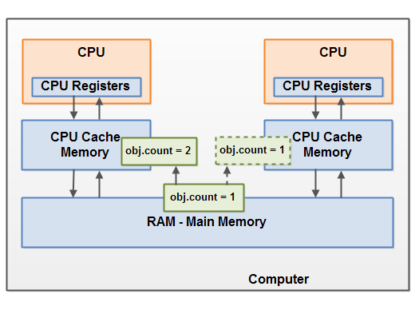
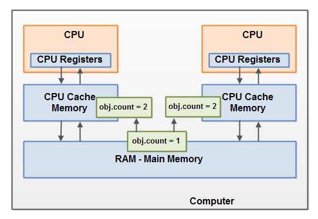

# Java内存模型

Java内存模型规定了Java虚拟机如何与计算机的内存（RAM）一起工作。Java虚拟机是整个计算机的模型，因此这个模型自然包括了内存模型 - 即Java内存模型。

如果你想设计正确行为的并发程序，理解Java内存模型非常重要。Java内存模型规定了不同线程何时可以看到其他线程写入共享变量的值，以及在必要时如何同步对共享变量的访问。

原始的Java内存模型是不充分的，因此在Java 1.5中对Java内存模型进行了修订。这个版本的Java内存模型至今仍在使用（Java 14+）。

## 内部Java内存模型

Java虚拟机内部使用的Java内存模型将内存划分为线程栈和堆。下图从逻辑角度说明了Java内存模型：


在Java虚拟机中运行的每个线程都有自己的线程栈。线程栈包含有关线程调用了哪些方法以到达当前执行点的信息。我将这称为“调用栈”。当线程执行其代码时，调用栈会发生变化。

线程栈还包含每个正在执行的方法的所有局部变量（调用栈中的所有方法）。一个线程只能访问自己的线程栈。由线程创建的局部变量对创建它的线程以外的所有线程都是不可见的。即使两个线程执行完全相同的代码，这两个线程仍将在各自的线程栈中创建该代码的局部变量。因此，每个线程都有自己的每个局部变量的版本。

所有原始类型（`boolean`, `byte`, `short`, `char`, `int`, `long`, `float`, `double`）的局部变量都完全存储在线程栈上，因此对其他线程不可见。一个线程可以将原始变量的副本传递给另一个线程，但它不能共享原始局部变量本身。

堆包含Java应用程序中创建的所有对象，无论哪个线程创建了该对象。这包括原始类型的对象版本（例如`Byte`, `Integer`, `Long`等）。

无论对象是被创建并分配给局部变量，还是作为另一个对象的成员变量被创建，对象仍然存储在堆上。

下图说明了存储在线程栈上的调用栈和局部变量，以及存储在堆上的对象：


局部变量可以是原始类型，在这种情况下，它完全存储在线程栈上。

局部变量也可以是对对象的引用。在这种情况下，引用（局部变量）存储在线程栈上，但对象本身存储在堆上。

对象可能包含方法，这些方法可能包含局部变量。这些局部变量也存储在线程栈上，即使所属对象存储在堆上。

对象的成员变量与对象本身一起存储在堆上。无论是原始类型的成员变量，还是对对象的引用，都是如此。

静态类变量也与类定义一起存储在堆上。

堆上的对象可以被所有有引用的线程访问。当一个线程访问一个对象时，它也可以访问该对象的成员变量。如果两个线程同时对同一个对象调用方法，它们都将能够访问该对象的成员变量，但每个线程都有自己的局部变量副本。

下图说明了上述各点：


两个线程有一组局部变量。其中一个局部变量（`Local Variable 2`）指向堆上共享的对象（Object 3）。两个线程各自有不同的引用指向同一个对象。它们的引用是局部变量，因此存储在每个线程的线程栈上（每个线程一个）。两个不同的引用指向堆上的同一个对象。

注意共享对象（Object 3）如何通过成员变量引用指向Object 2和Object 4（由Object 3指向Object 2和Object 4的箭头说明）。通过Object 3中的这些成员变量引用，两个线程可以访问Object 2和Object 4。

图表还显示了一个指向堆上两个不同对象的局部变量。在这种情况下，引用指向两个不同的对象（Object 1和Object 5），而不是同一个对象。理论上，如果两个线程都有对两个对象的引用，两个线程都可以访问Object 1和Object 5。但在上面的图表中，每个线程只有对两个对象中的一个的引用。

那么，什么样的Java代码可能导致上述内存图呢？像下面的代码一样简单：

```java
public class MyRunnable implements Runnable() {
    public void run() {
        methodOne();
    }

    public void methodOne() {
        int localVariable1 = 45;

        MySharedObject localVariable2 =
            MySharedObject.sharedInstance;

        //... do more with local variables.

        methodTwo();
    }

    public void methodTwo() {
        Integer localVariable1 = new Integer(99);

        //... do more with local variable.
    }
}

public class MySharedObject {
    //static variable pointing to instance of MySharedObject
    public static final MySharedObject sharedInstance =
        new MySharedObject();

    //member variables pointing to two objects on the heap
    public Integer object2 = new Integer(22);
    public Integer object4 = new Integer(44);

    public long member1 = 12345;
    public long member2 = 67890;
}
```

如果两个线程执行`run()`方法，那么前面显示的图表将是结果。`run()`方法调用`methodOne()`，`methodOne()`调用`methodTwo()`。

`methodOne()`声明了一个原始局部变量（`localVariable1`类型为`int`）和一个局部变量，这是一个对象引用（`localVariable2`）。

每个执行`methodOne()`的线程将在它们各自的线程栈上创建`localVariable1`和`localVariable2`的副本。`localVariable1`变量将完全分离，只存在于每个线程的线程栈上。一个线程不能看到另一个线程对其`localVariable1`副本所做的更改。

每个执行`methodOne()`的线程还将创建它们自己的`localVariable2`副本。然而，两个不同的`localVariable2`副本最终都指向堆上的同一个对象。代码将`localVariable2`设置为指向由静态变量引用的对象。静态变量只有一个副本，这个副本存储在堆上。因此，两个`localVariable2`副本最终都指向静态变量所指向的同一个`MySharedObject`实例。`MySharedObject`实例也存储在堆上。它对应于上图中的Object 3。

注意`MySharedObject`类也包含两个成员变量。成员变量本身与对象一起存储在堆上。这两个成员变量指向另外两个`Integer`对象。这些`Integer`对象对应于上图中的Object 2和Object 4。

还要注意`methodTwo()`创建了一个名为`localVariable1`的局部变量。这个局部变量是对`Integer`对象的引用。该方法将`localVariable1`引用设置为指向一个新的`Integer`实例。`localVariable1`引用将存储在每个执行`methodTwo()`的线程的一个副本中。实例化的两个`Integer`对象将存储在堆上，但由于该方法每次执行时都会创建一个新的`Integer`对象，因此执行此方法的两个线程将创建单独的`Integer`实例。在`methodTwo()`中创建的`Integer`对象对应于上图中的Object 1和Object 5。

还要注意类`MySharedObject`中的两个`long`类型的成员变量，这是一个原始类型。由于这些变量是成员变量，它们仍然与对象一起存储在堆上。只有局部变量存储在线程栈上。

## 硬件内存架构

现代硬件内存架构与内部Java内存模型有些不同。了解硬件内存架构也很重要，以理解Java内存模型如何与其配合工作。本节描述了常见的硬件内存架构，后面的部分将描述Java内存模型如何与其配合工作。

下图是现代计算机硬件架构的简化图：


现代计算机通常包含2个或更多的CPU。其中一些CPU可能有多个核心。关键是，在具有2个或更多CPU的现代计算机上，可以同时运行多个线程。每个CPU都能够在任何给定时间运行一个线程。这意味着，如果你的Java应用程序是多线程的，一个CPU的一个线程可能在你的Java应用程序内同时（并发地）运行。

每个CPU包含一组寄存器，这些寄存器本质上是内部CPU内存。CPU对这些寄存器执行操作的速度远远快于对主内存中变量执行操作的速度。那是因为CPU访问这些寄存器的速度远远快于访问主内存。

每个CPU也可能有自己的CPU缓存内存层。实际上，大多数现代CPU都有某种大小的缓存内存层。CPU访问其缓存内存的速度远远快于主内存，但通常不像访问其内部寄存器那样快。所以，CPU缓存内存在内部寄存器的速度和主内存速度之间。一些CPU可能有多个缓存层（一级和二级），但这并不重要了解如何理解Java内存模型与内存的交互。重要的是要知道CPU可能有某种缓存内存层。

计算机还包括一个主内存区域（RAM）。所有CPU都可以访问主内存。主内存区域通常比CPU的缓存内存大得多。

通常，当CPU需要访问主内存时，它会将主内存的一部分读入其CPU缓存。它甚至可能将缓存的一部分读入其内部寄存器，然后对其进行操作。当CPU需要将结果写回主内存时，它会将值从内部寄存器刷新到缓存内存，并在某个时候将值刷新回主内存。

存储在缓存内存中的值通常在CPU需要在缓存内存中存储其他东西时刷新回主内存。CPU缓存可以一次写入其内存的一部分，并一次刷新其内存的一部分。它不必每次更新时都读取/写入整个缓存。通常，缓存以称为“缓存行”的较小内存块进行更新。一个或多个缓存行可能被读入缓存内存，一个或多个缓存行可能再次被刷新回主内存。

## 弥合Java内存模型和硬件内存架构之间的差距

正如已经提到的，Java内存模型和硬件内存架构是不同的。硬件内存架构没有区分线程栈和堆。在硬件上，线程栈和堆都位于主内存中。线程栈和堆的部分有时可能在CPU缓存和内部CPU寄存器中。这在下图中进行了说明：


当对象和变量可以存储在计算机中的各种不同的内存区域时，可能会出现某些问题。两个主要问题是：

- 线程更新（写入）共享对象的可见性。
- 读取、检查和写入共享变量时的竞态条件。

下面几节将解释这两个问题。

### 共享对象的可见性

如果两个或更多的线程共享一个对象，而没有适当使用`volatile`声明或同步，一个线程对共享对象所做的更新可能对其他线程不可见。

设想共享对象最初存储在主内存中。运行在CPU上的一个线程然后将共享对象读入其CPU缓存。在那里它更改了共享对象。只要CPU缓存没有被刷新回主内存，更改后的共享对象版本就对运行在其他CPU上的线程不可见。这样，每个线程最终可能会得到自己对共享对象的副本，每个副本位于不同的CPU缓存中。

下图说明了上面概述的情况。运行在左侧CPU上的一个线程将共享对象复制到其CPU缓存中，并将`count`变量更改为2。这个更改对运行在右侧CPU上的其他线程不可见，因为对`count`的更新还没有被刷新回主内存。



要解决这个问题，你可以使用Java的`volatile`关键字。`volatile`关键字可以确保给定变量直接从主内存中读取，并且在更新时总是写回到主内存。

### 竞态条件

如果两个或更多的线程共享一个对象，并且多个线程更新该共享对象中的变量，则可能发生竞态条件。

设想线程A将共享对象的变量`count`读入其CPU缓存。设想线程B也这样做，但是到不同的CPU缓存中。现在线程A将`count`加一，线程B也这样做。现在`var1`已经被增加了两次，每次在每个CPU缓存中。

如果这些增加是顺序执行的，那么变量`count`将被增加两次，并且原始值 + 2将被写回主内存。

然而，这两个增加是并发执行的，没有适当的同步。不管线程A和B中的哪一个将其更新后的`count`版本写回主内存，更新后的值只会比原始值高1，尽管有两次增加。

这张图说明了上面描述的竞态条件问题的发生：



要解决这个问题，你可以使用Java同步块。同步块确保在任何给定时间只有一个线程可以进入代码的给定关键部分。同步块还保证在同步块内部访问的所有变量都将从主内存中读取，当线程退出同步块时，所有更新的变量将再次被刷新回主内存，无论变量是否声明为volatile。


