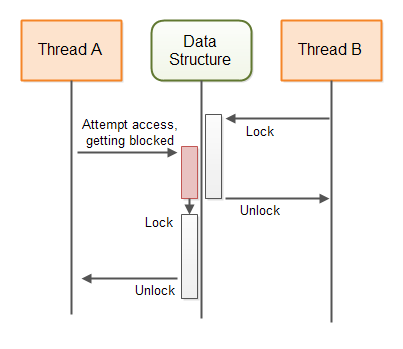

# 非阻塞算法

在并发的背景下，非阻塞算法是允许线程访问共享状态（或以其他方式协作或通信）而不阻塞参与线程的算法。更一般地说，如果一个线程的挂起不能导致参与算法的其他线程的挂起，则该算法被称为非阻塞的。

为了更好地理解阻塞和非阻塞并发算法之间的区别，我将首先解释阻塞算法，然后继续介绍非阻塞算法。

## 阻塞并发算法

阻塞并发算法是一种算法，它要么：
- A: 执行线程请求的操作 - 或者
- B: 阻塞线程，直到操作可以安全执行

许多类型的算法和并发数据结构都是阻塞的。例如，java.util.concurrent.BlockingQueue接口的不同实现都是阻塞数据结构。如果一个线程尝试向`BlockingQueue`插入一个元素，而队列没有空间，插入线程将被阻塞（挂起），直到`BlockingQueue`有空间容纳新元素。

这张图表说明了保护共享数据结构的阻塞算法的行为：


## 非阻塞并发算法

非阻塞并发算法是一种算法，它要么：
- A: 执行线程请求的操作 - 或者
- B: 通知请求操作的线程操作无法执行

Java中也包含几个非阻塞数据结构。AtomicBoolean、AtomicInteger、AtomicLong和AtomicReference都是非阻塞数据结构的例子。

这张图表说明了保护共享数据结构的非阻塞算法的行为：


## 非阻塞与阻塞算法

阻塞和非阻塞算法之间的主要区别在于它们在上述两节中描述的行为的第二步。换句话说，区别在于当请求的操作无法执行时，阻塞和非阻塞算法分别会做什么：

阻塞算法会阻塞线程，直到可以执行请求的操作。非阻塞算法会通知请求操作的线程操作无法执行。

使用阻塞算法，一个线程可能被阻塞，直到可以执行请求的操作。通常，这将是另一个线程的操作，使得第一个线程可以执行请求的操作。如果由于某种原因，那个另一个线程在应用程序的其他地方被挂起（阻塞），并且因此无法执行使第一个线程的请求操作成为可能的操作，第一个线程就会保持被阻塞 - 要么无限期，要么直到那个线程最终执行必要的操作。

例如，如果一个线程尝试向一个满的`BlockingQueue`插入一个元素，该线程将被阻塞，直到另一个线程从`BlockingQueue`中取出一个元素。如果那个应该从`BlockingQueue`中取出元素的线程由于某种原因在应用程序的其他地方被阻塞（挂起），尝试插入新元素的线程就会保持被阻塞 - 要么无限期，要么直到取出元素的线程最终从`BlockingQueue`中取出一个元素。

## 非阻塞并发数据结构

在多线程系统中，线程通常通过某种数据结构进行通信。这些数据结构可以是简单的变量，也可以是更高级的数据结构，如队列、映射、栈等。为了促进多个线程对数据结构的正确并发访问，数据结构必须由某种并发算法保护。保护算法是使数据结构成为并发数据结构的原因。

如果保护并发数据结构的算法是阻塞的（使用线程挂起），则它被称为阻塞算法。数据结构因此被称为阻塞并发数据结构。

如果保护并发数据结构的算法是非阻塞的，它被称为非阻塞算法。数据结构因此被称为非阻塞并发数据结构。

每个并发数据结构都被设计为支持某种通信方法。你可以使用哪种并发数据结构取决于你的通信需求。我将在以下部分介绍一些非阻塞并发数据结构，并解释它们可以在什么情况下使用。这些非阻塞数据结构的工作原理的解释应该能让你了解非阻塞数据结构是如何设计和实现的。

## 易失性变量

Java易失性变量总是直接从主内存中读取。当给易失性变量分配一个新值时，该值总是立即写入主内存。这保证了其他在其他CPU上运行的线程始终能看到易失性变量的最新值。其他线程每次都将从主内存中读取易失性的值，而不是例如从它们正在运行的CPU的CPU缓存中读取。

易失性变量是非阻塞的。向易失性变量写入值是原子操作。它不能被中断。然而，对易失性变量执行的读-更新-写序列不是原子的。因此，如果由多个线程执行以下代码，可能会导致竞争条件：

```
volatile myVar = 0;

...
int temp = myVar;
temp++;
myVar = temp;

```

首先，从主内存中读取易失性变量`myVar`的值到一个临时变量中。然后，将临时变量增加1。然后，将临时变量的值分配给易失性变量`myVar`，这意味着它将被写回到主内存。

如果两个线程执行此代码，并且两个线程都读取`myVar`的值，向它添加1，并将值写回主内存，那么就有可能不是向`myVar`变量添加2，而只添加1（例如，两个线程都读取值为19，增加到20，并将20写回）。

你可能认为你不会写上面的代码，但实际上，上面的代码等同于此：

```
myVar++;

```

执行时，`myVar`的值被读入CPU寄存器或本地CPU缓存，增加1，然后从CPU寄存器或CPU缓存写回主内存。

### 单一写入者情况

在某些情况下，只有一个线程写入共享变量，而多个线程读取该变量的值。当只有一个线程更新变量时，无论有多少线程正在读取它，都不会发生竞争条件。因此，每当只有一个共享变量的写入者时，你可以使用一个易失性变量。

当多个线程对共享变量执行读-更新-写序列操作时，就会发生竞争条件。如果只有一个线程执行读-更新-写序列操作，而所有其他线程只执行读取操作，那么就没有竞争条件。

以下是一个单一写入者计数器，它不使用同步，但仍然是并发的：

```
public class SingleWriterCounter {

    private volatile long count = 0;

    /**
     * 只有一个线程可以调用此方法，
     * 否则将导致竞争条件。
     */
    public void inc() {
        this.count++;
    }

    /**
     * 多个读取线程可以调用此方法
     * @return
     */
    public long count() {
        return this.count;
    }
}

```

多个线程可以访问这个计数器的同一个实例，只要只有一个线程调用`inc()`。我的意思不是一个接一个的线程。我的意思是，只允许同一个、单一的线程调用`inc()`。
多个线程可以调用`count()`。这不会引起任何竞争条件。

这张图表说明了线程将如何访问易失性`count`变量：


### 更高级的基于易失性变量的数据结构

可以创建使用易失性变量组合的数据结构，其中每个易失性变量只由一个线程写入，并由多个线程读取。每个易失性变量可以由不同的线程（但只有一个线程）写入。使用这样的数据结构，多个线程可能能够以非阻塞的方式使用易失性变量相互发送信息。

以下是一个简单的双写入者计数器类，展示了如何实现：

```
public class DoubleWriterCounter {

    private volatile long countA = 0;
    private volatile long countB = 0;

    /**
     * 只有一个（从那时起同一个）线程可以调用此方法，
     * 否则将导致竞争条件。
     */
    public void incA() { this.countA++;  }

    /**
     * 只有一个（从那时起同一个）线程可以调用此方法，
     * 否则将导致竞争条件。
     */
    public void incB() { this.countB++;  }

    /**
     * 多个读取线程可以调用此方法
     */
    public long countA() { return this.countA; }

    /**
     * 多个读取线程可以调用此方法
     */
    public long countB() { return this.countB; }
}

```

如你所见，`DoubleWriterCounter`现在包含两个易失性变量和两对增加和读取方法。只有一个线程可以调用`incA()`，只有一个线程可以调用`incB()`。不过，调用`incA()`和`incB()`的可以是不同的线程。
允许多个线程调用`countA()`和`countB()`。这不会引起竞争条件。

`DoubleWriterCounter`可用于例如两个线程之间的通信。这两个计数可以是生产任务和消费任务。这张图表显示了两个线程通过类似于上述的数据结构进行通信：


精明的读者会认识到，你可以使用两个`SingleWriterCounter`实例来实现`DoubleWriterCounter`的效果。你甚至可以使用更多的线程和`SingleWriterCounter`实例，如果你需要的话。

## 带有比较和交换的乐观锁定

如果你真的需要多个线程写入同一个共享变量，易失性变量将是不够的。你将需要某种对变量的独占访问。以下是使用Java中的同步块实现这种独占访问的方式：

```
public class SynchronizedCounter {
    long count = 0;

    public void inc() {
        synchronized(this) {
            count++;
        }
    }

    public long count() {
        synchronized(this) {
            return this.count;
        }
    }
}

```

注意`inc()`和`count()`方法都包含一个同步块。这正是我们想要避免的 - 同步块和`wait()` `notify()`调用等。

而不是两个同步块，我们可以使用Java的一个原子变量。在这种情况下是`AtomicLong`。以下是使用`AtomicLong`的相同计数器类的实现方式：

```
import java.util.concurrent.atomic.AtomicLong;

public class AtomicCounter {
    private AtomicLong count = new AtomicLong(0);

    public void inc() {
        boolean updated = false;
        while(!updated){
            long prevCount = this.count.get();
            updated = this.count.compareAndSet(prevCount, prevCount + 1);
        }
    }

    public long count() {
        return this.count.get();
    }
}

```

这个版本和以前的版本一样线程安全。这个版本有趣的是`inc()`方法的实现。`inc()`方法不再包含同步块。相反，它包含这些行：

```
boolean updated = false;
while(!updated){
    long prevCount = this.count.get();
    updated = this.count.compareAndSet(prevCount, prevCount + 1);
}

```

这些行不是一个原子操作。这意味着，如果两个不同的线程调用`inc()`方法并执行`long prevCount = this.count.get()`语句，那么它们都可能获得计数器的前一个计数。然而，上面的代码不包含任何竞争条件。

秘密在于`while`循环内的第二行。`compareAndSet()`方法调用是一个原子操作。它将`AtomicLong`的内部值与预期值进行比较，如果两个值相等，就为`AtomicLong`设置一个新的内部值。`compareAndSet()`方法通常由CPU中直接的比较和交换指令支持。因此不需要同步，也不需要线程挂起。这节省了线程挂起的开销。

设想`AtomicLong`的内部值为20。然后两个线程读取该值，并都尝试调用`compareAndSet(20, 20 + 1)`。由于`compareAndSet()`是一个原子操作，这些线程将按顺序（一次一个）执行这个方法。

第一个线程将预期值20（计数器的前一个值）与`AtomicLong`的内部值进行比较。由于这两个值相等，`AtomicLong`将更新其内部值为21（20 + 1）。`updated`变量将设置为`true`，并且`while`循环将停止。

现在第二个线程调用`compareAndSet(20, 20 + 1)`。由于`AtomicLong`的内部值不再是20，这个调用将失败。`AtomicLong`的内部值将不会被设置为21。
`updated`变量将设置为`false`，并且线程将在`while`循环中再多旋转一次。这次它将读取值21并尝试将其更新为22。如果没有其他线程在此期间调用`inc()`，第二次迭代将成功将`AtomicLong`更新为22。

### 为什么它被称为乐观锁定？

前一节中显示的代码被称为乐观锁定。乐观锁定与传统锁定不同，有时也称为悲观锁定。传统锁定通过同步块或某种锁定来阻止对共享内存的访问。同步块或锁定可能导致线程挂起。

乐观锁定允许所有线程在没有任何阻塞的情况下创建共享内存的副本。然后，线程可以修改他们的副本，并尝试将修改后的版本写回共享内存。如果没有其他线程对共享内存进行了修改，比较和交换操作允许线程将其更改写入共享内存。如果另一个线程已经更改了共享内存，线程将不得不获取一个新的副本，进行更改，并再次尝试将其写入共享内存。

之所以称其为乐观锁定，是因为线程在乐观的假设下获得他们想要更改的数据的副本并应用更改，即没有其他线程在此期间对共享内存进行了更改。当这种乐观的假设成立时，线程就成功地在没有锁定的情况下更新了共享内存。当这种假设是错误的时候，工作就白费了，但仍然没有应用锁定。

乐观锁定在共享内存的争用低到中等时效果最好。如果共享内存的争用非常高，线程将浪费大量的CPU周期来复制和修改共享内存，只是最终未能将更改写回共享内存。但是，如果你的共享内存有很多争用，你应该无论如何考虑重新设计你的代码以降低争用。

### 乐观锁定是非阻塞的

我在这里展示的乐观锁定机制是非阻塞的。如果一个线程获得了共享内存的副本，并在尝试修改它时被阻塞（出于任何原因），没有其他线程被阻止访问共享内存。

在传统的锁定/解锁范式中，当一个线程锁定一个锁 - 那个锁对所有其他线程保持锁定，直到拥有锁的线程再次解锁它。如果锁定锁的线程在其他地方被阻塞，那个锁就会保持锁定很长时间 - 甚至可能无限期。

## 非交换数据结构

简单的比较和交换乐观锁定适用于可以在整个数据结构中进行交换（交换）的共享数据结构。用单个比较和交换操作交换整个数据结构或修改副本可能并不总是可能或可行的。

想象一下，如果共享数据结构是一个队列。每个尝试从队列中插入或取出元素的线程都必须复制整个队列并对副本进行所需的修改。这可以通过`AtomicReference`来实现。复制引用，复制和修改队列，并尝试将`AtomicReference`指向的引用交换到新创建的队列。

然而，大型数据结构可能需要大量的内存和CPU周期来复制。这将使你的应用程序花费更多的内存，并在复制上浪费大量时间。这将特别影响你的应用程序的性能，如果对数据结构的争用很高的话。此外，线程复制和修改数据结构的时间越长，其他线程在之间修改数据结构的可能性就越大。如你所知，如果另一个线程自从它被复制以来已经修改了共享数据结构，所有其他线程都必须重新启动它们的复制-修改操作。这将进一步增加对性能影响和内存消耗。

下一节将解释一种实现可以同时更新的非阻塞数据结构的方法，而不仅仅是复制和修改。

## 分享预期修改

而不是复制和修改整个共享数据结构，一个线程可以分享其对共享数据结构的_预期修改_。一个线程想要对共享数据结构进行修改的过程就变成了：

1. 检查是否有另一个线程提交了对数据结构的预期修改。
2. 如果没有其他线程提交预期修改，创建一个预期修改（由对象表示）并使用比较和交换操作将该预期修改提交到数据结构。
3. 对共享数据结构进行修改。
4. 移除对预期修改的引用，向其他线程发出信号，表示预期修改已经完成。

正如你所看到的，第二步可以阻止其他线程提交预期修改。因此，第二步实际上充当了共享数据结构的锁。如果一个线程成功提交了一个预期修改，没有其他线程可以提交预期修改，直到第一个预期修改完成。

如果一个线程提交了一个预期修改，然后在做一些其他工作时被阻塞，共享数据结构实际上就被锁定了。共享数据结构并不直接使用数据结构阻塞其他线程。其他线程可以检测到它们无法提交预期修改，并决定做其他事情。显然，我们需要解决这个问题。

### 可完成的预期修改

为了避免提交的预期修改可以锁定共享数据结构，提交的预期修改对象必须包含足够的信息，以便另一个线程可以完成修改。因此，如果提交预期修改的线程从未完成修改，另一个线程可以代表它完成修改，并保持共享数据结构对其他线程可用。

以下是一张图表，说明了上述描述的非阻塞算法的蓝图：


修改必须作为一项或多项比较和交换操作来执行。因此，如果两个线程尝试完成预期修改，只有一个线程能够执行任何比较和交换操作。一旦完成了比较和交换操作，进一步尝试完成该比较和交换操作将失败。

## A-B-A问题

上述算法可能遭受A-B-A问题的困扰。A-B-A问题指的是变量从A变为B，然后再变回A的情况。对于另一个线程来说，因此无法检测到变量确实发生了变化。

如果线程A检查正在进行的更新，复制数据并被线程调度器挂起，线程B可能在此期间能够访问共享数据结构。如果线程B对数据结构进行了完整更新，并移除了它的预期修改，对线程A来说，看起来好像没有发生修改，因为它复制了数据结构。然而，确实发生了修改。当线程A继续基于其现在过时的复制品执行更新时，数据结构将撤销线程B的修改。

下图说明了上述情况下的A-B-A问题：


### A-B-A解决方案

解决A-B-A问题的常见方法是不仅交换指向预期修改对象的指针，而是将指针与计数器结合，并使用单个比较和交换操作交换指针+计数器。这在支持指针的语言中是可能的，如C和C++。即使当前修改指针被设置回指向“无正在进行的修改”，指针+计数器的计数器部分也将增加，使更新对其他线程可见。

在Java中，你不能将引用和计数器合并成单个变量。相反，Java提供了`AtomicStampedReference`类，它可以使用比较和交换操作原子地交换引用和时间戳。

## 非阻塞算法模板

以下是一个代码模板，旨在让你了解非阻塞算法是如何实现的。该模板基于本教程前面给出的描述。

注意：我不是非阻塞算法的专家，所以下面的模板可能有一些错误。不要基于我的模板实现你自己的非阻塞算法。模板仅旨在让你了解非阻塞算法的代码可能是什么样子。如果你想实现你自己的非阻塞算法，首先研究一些真正的、工作的非阻塞算法实现，以了解更多关于它们在实践中是如何实现的。

```
import java.util.concurrent.atomic.AtomicBoolean;
import java.util.concurrent.atomic.AtomicStampedReference;

public class NonblockingTemplate {

    public static class IntendedModification {
        public AtomicBoolean completed =
                new AtomicBoolean(false);
    }

    private AtomicStampedReference<IntendedModification>
        ongoingMod =
            new AtomicStampedReference<IntendedModification>(null, 0);

    // 在这里声明数据结构的状态。

    public void modify() {
        while(!attemptModifyASR());
    }

    public boolean attemptModifyASR(){
        boolean modified = false;

        IntendedModification currentlyOngoingMod =
            ongoingMod.getReference();
        int stamp = ongoingMod.getStamp();

        if(currentlyOngoingMod == null){
            // 复制数据结构状态 - 用于
            // 在预期修改中

            // 准备预期修改
            IntendedModification newMod =
                new IntendedModification();

            boolean modSubmitted =
                ongoingMod.compareAndSet(null, newMod, stamp, stamp + 1);

            if(modSubmitted){

                // 通过一系列比较和交换操作完成修改。
                // 注意：其他线程可能协助完成比较和交换
                // 操作，所以一些CAS可能会失败

                modified = true;
            }

        } else {
            // 尝试完成正在进行的修改，以便数据结构可以被此线程访问。

            modified = false;
        }

        return modified;
    }
}

```

## 非阻塞算法难以实现

非阻塞算法难以设计和正确实现。在尝试实现你自己的非阻塞算法之前，请看看是否有人已经为你的需求开发了非阻塞算法。

Java已经包含了一些非阻塞实现（例如`ConcurrentLinkedQueue`），并且在未来Java版本中很可能会获得更多的非阻塞算法实现。

除了Java内置的非阻塞数据结构外，还有一些开源的非阻塞数据结构可以使用。例如，LMAX Disrupter（一种类似队列的数据结构），以及Cliff Click的非阻塞HashMap。请参阅我的Java并发参考资料页面，了解更多资源的链接。

## 非阻塞算法的好处

与阻塞算法相比，非阻塞算法有几个好处。本节将描述这些好处。

### 选择

非阻塞算法的第一个好处是，当请求的操作无法执行时，线程可以选择做什么。而不仅仅是被阻塞，请求线程可以选择做什么。有时一个线程什么也做不了。在这种情况下，它可以选择阻塞或等待自己，从而为其他任务释放CPU。但至少请求线程被给予了选择。

在单CPU系统上，挂起一个无法执行所需操作的线程，让其他能够执行工作的线程在CPU上运行可能是有意义的。但即使在单CPU系统上，阻塞算法也可能导致死锁、饥饿和其他并发问题。

### 无死锁

非阻塞算法的第二个好处是，一个线程的挂起不能导致其他线程的挂起。这意味着死锁不能发生。两个线程不能因为等待对方释放他们想要的锁而被阻塞。由于线程在无法执行请求的操作时不会被阻塞，它们就不会因为等待对方而变得阻塞。非阻塞算法仍可能导致活锁，其中一个线程不断尝试某个操作，但不断被告知这是不可能的（因为另一个线程的操作）。

### 无线程挂起

挂起和重新激活线程是昂贵的。是的，随着操作系统和线程库变得更加高效，挂起和重新激活的成本已经降低。然而，线程挂起和重新激活仍然需要付出高昂的代价。

每当一个线程被阻塞时，它就被挂起，因此产生了线程挂起和重新激活的开销。由于非阻塞算法不会挂起线程，这种开销就不会发生。这意味着CPU可以更多地花时间执行实际的业务逻辑，而不是上下文切换。

在多CPU系统上，阻塞算法可能对整体性能产生更大的影响。在CPU A上运行的线程可能会因为等待在CPU B上运行的线程而被阻塞。这降低了应用程序能够实现的并行级别。当然，CPU A可以只安排另一个线程运行，但挂起和激活线程（上下文切换）是昂贵的。线程需要挂起的越少越好。

### 降低线程延迟

在这里，延迟指的是请求的操作变得可能到线程实际执行它之间的时间。由于非阻塞算法不会挂起线程，它们不必支付昂贵、缓慢的重新激活开销。这意味着当请求的操作变得可能时，线程可以更快地响应，从而降低它们的响应延迟。

非阻塞算法通常通过忙等待直到请求的操作变得可能来获得较低的延迟。当然，在对非阻塞数据结构有高线程争用的系统中，CPU在这些忙等待期间可能会消耗大量的周期。这是需要记住的事情。如果你的数据结构有高线程争用，非阻塞算法可能不是最好的。然而，通常有办法重新设计你的应用程序，使其线程争用更少。


