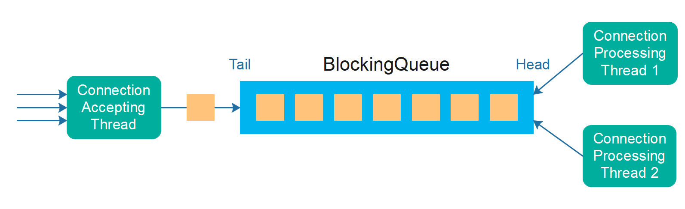

# 生产者-消费者模式

生产者-消费者模式是一种并发设计模式，其中一个或多个生产者线程生成对象，这些对象被排队，然后由一个或多个消费者线程消耗。通常，这些排队的对象代表需要完成的工作。
将工作的检测与工作的执行解耦意味着你可以控制一次参与检测或执行工作的线程数量。

## 使用场景
生产者-消费者设计模式有几种不同的使用场景。其中一些最常见的包括：
- 减少前台线程延迟。
- 在不同线程之间平衡工作负载。
- 管理反压。

### 减少前台线程延迟
在某些系统中，你可能有一个与外界通信的单一前台线程。
在服务器中，它可能是接受来自客户端的传入连接的线程。
在桌面应用程序中，那可能是UI线程。

为了不让前台线程忙于任务——无论前台线程从外界接收到什么任务，都将被卸载到一个或多个后台线程。
在服务器中，它可能是通过传入连接接收的数据进行处理。

在桌面应用程序中，前台线程(UI线程)可能正在响应用户事件——例如打开文件，或下载文件，或保存文件等。为了避免UI线程被阻塞，导致整个GUI无响应，UI线程可以将长时间运行的任务卸载到后台工作线程。

### 在线程之间平衡工作负载
生产者-消费者模式的另一种使用场景是在一组工作线程之间平衡工作负载。
实际上，只要工作线程在有空处理它们时立即从队列中取出新任务对象，这种负载平衡就会自动发生。这将在工作线程之间平衡任务。

### 管理反压
如果生产者和消费者线程之间的队列是一个Java BlockingQueue，那么你可以使用队列进行反压管理。这是生产者-消费者模式的另一个内置特性。

反压意味着，如果生产者线程(们)产生的工作量超过了消费者线程能够处理的——任务将在队列中排队。在某个时候，BlockingQueue将变得已满，生产者线程在尝试将新任务/工作对象插入队列时将被阻塞。这种现象称为反压。系统对生产者施加压力——向“管道”的开始方向——阻止更多的工作进来。

反压将“溢出”队列，并减慢生产者线程(们)的速度。因此，如果整个管道中有更早的步骤，它们也可以将压力向上游工作管道传播。

