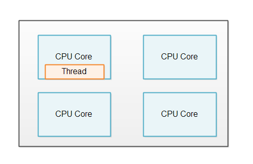
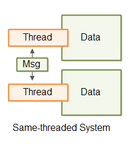
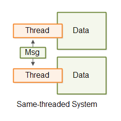

# 单线程

同线程并发模型是一种将单线程系统扩展到N个单线程系统的模型。结果是N个单线程系统并行运行。

同线程系统不是一个纯粹的单线程系统，因为它包含多个线程。但是，每个线程都像单线程系统一样运行。因此，使用术语_same-threaded_（同线程）而不是single-threaded（单线程）。

## 为什么选择单线程系统？
您可能想知道为什么今天还有人会设计单线程系统。单线程系统之所以受欢迎，是因为它们的并发模型比多线程系统简单得多。单线程系统不与其他线程共享任何状态（对象/数据）。这使得单个线程可以使用非并发数据结构，并更好地利用CPU和CPU缓存。

不幸的是，单线程系统没有充分利用现代CPU。现代CPU通常有2、4、6、8个或更多的核心。每个核心都作为一个单独的CPU运行。单线程系统只能利用其中一个核心，如下所示：


## 同线程：单线程扩展
为了利用CPU中的所有核心，单线程系统可以扩展以利用整个计算机。

### 每个CPU一个线程
同线程系统通常在计算机中的每个CPU上运行1个线程。如果计算机包含4个CPU，或者一个CPU有4个核心，那么通常运行4个同线程系统的实例（4个单线程系统）。下图展示了这个原则：


## 无共享状态
同线程系统看起来类似于传统的多线程系统，因为同线程系统在其内部运行多个线程。但有一个微妙的区别。

同线程和传统多线程系统的区别在于，同线程系统中的线程不共享状态。没有线程同时访问的共享内存。没有通过并发数据结构等方式共享数据。这个区别在这里进行了说明：


缺乏共享状态是使每个线程表现得像单线程系统的原因。然而，由于同线程系统可以包含多个线程，它实际上并不是一个“单线程系统”。由于缺乏更好的名称，我发现将这样的系统称为_same-threaded_（同线程）系统比“具有单线程设计的多线程系统”更准确。Same-threaded（同线程）更容易说，也更容易理解。

同线程基本上意味着数据处理保持在同一个线程内，并且同线程系统中的线程不并发共享数据。有时这也被称为无共享状态并发或独立状态并发。

## 负载分配
显然，同线程系统需要在运行的单线程实例之间共享工作负载。
如果只有一个线程得到任何工作，那么系统实际上就是单线程的。

您如何在不同线程之间分配负载取决于您的系统设计。我将在以下部分中介绍一些。

### 单线程微服务
如果您的系统由多个微服务组成，每个微服务都可以以单线程模式运行。当您将多个单线程微服务部署到同一台机器时，每个微服务可以在单个CPU上运行单个线程。

微服务本质上不共享任何数据，所以微服务是同线程系统的一个很好的用例。

### 具有分片数据的服务
如果您的系统确实需要共享数据，或者至少是一个数据库，您可能可以将数据库分片。分片意味着数据被划分为多个数据库。数据通常被划分，以便所有相关的数据都位于同一个数据库中。例如，所有属于某个“所有者”实体的数据都将插入到同一个数据库中。然而，分片不在本教程的范围内，所以您需要搜索有关该主题的教程。

## 线程通信
如果同线程系统中的线程需要通信，它们通过消息传递进行。如果线程A想向线程B发送消息，线程A可以通过生成消息（一个字节序列）来实现。然后线程B可以复制该消息（字节序列）并读取它。通过复制消息，线程B确保线程A在线程B读取时不能修改消息。一旦复制，消息副本对线程A不可见。

线程通信通过消息传递进行说明：


线程通信可以通过队列、管道、Unix套接字、TCP套接字等进行。任何适合您的系统。

## 更简单的并发模型
在同线程系统中，每个在自己的线程中运行的系统都可以实现为如果它是单线程的。这意味着内部并发模型比线程共享状态时简单得多。您不必担心并发数据结构以及这些数据结构可能导致的所有并发问题。

## 图解
这里是单线程、多线程和同线程系统的图解，以便您更容易地了解它们之间的区别。

第一张图显示了一个单线程系统。


第二张图显示了一个线程共享数据的多线程系统。


第三张图显示了一个有2个线程的同线程系统，它们具有独立数据，并通过相互传递消息进行通信。


## Java的Thread Ops
Java的Thread Ops是一个开源工具包，旨在帮助您更轻松地实现独立状态同线程系统。Thread Ops包含用于启动和停止单个线程的工具，以及在单个线程内实现一定程度并发的工具。如果您对玩同线程应用设计感兴趣，您可能会有兴趣看看Thread Ops。您可以在我的Thread Ops for Java教程中了解更多关于Thread Ops的信息。
```


