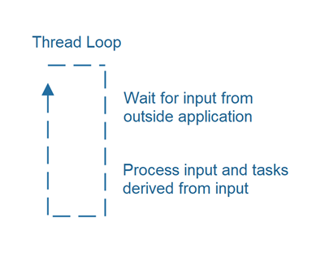
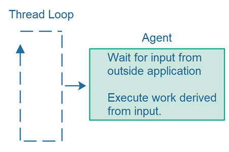
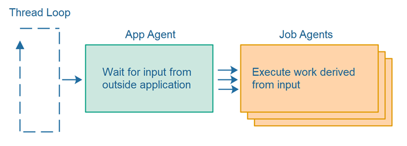
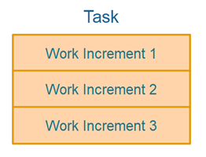
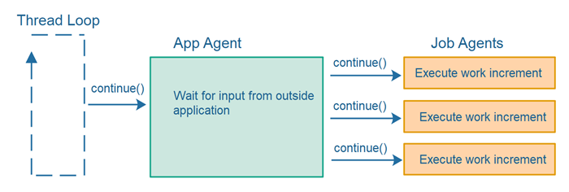
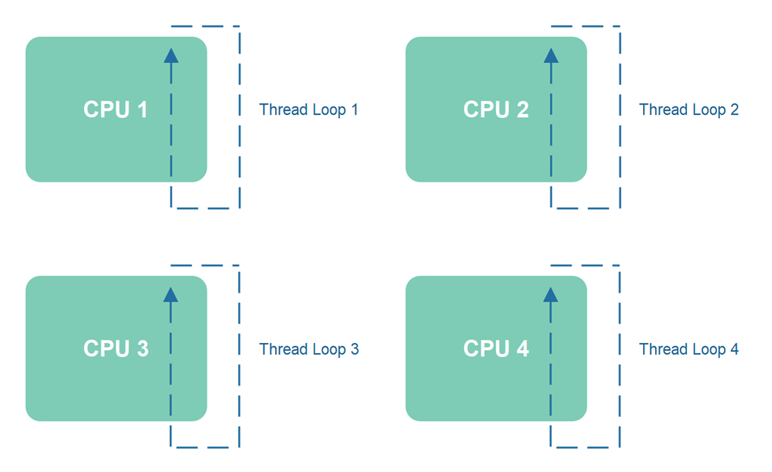
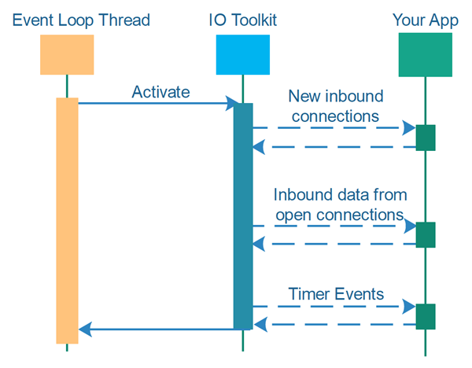
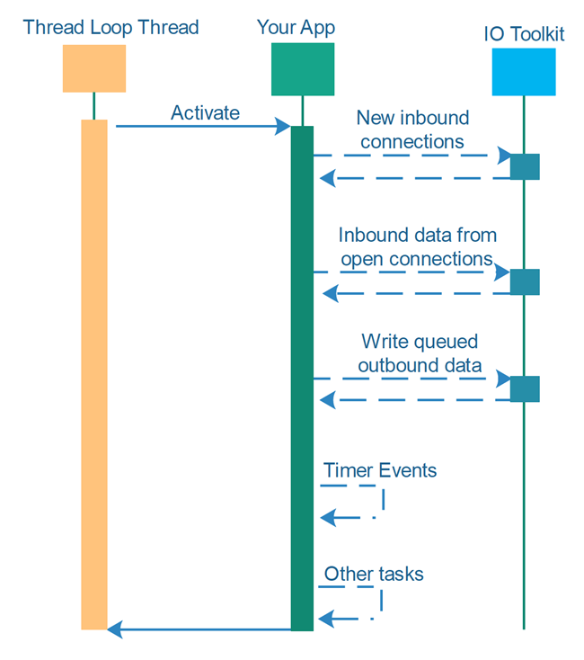

# 单线程并发

_单线程并发_是指在单个线程内同时取得多个任务的进展。传统上，你会使用多个线程来同时取得多个任务的进展，每个线程在自己的任务上取得进展。使用传统的多线程并发，不同任务之间的切换是由操作系统和CPU在不同线程之间进行的。然而，使用单线程并发技术，单个线程实际上可以通过在每个任务上取得进展来在多个任务上取得进展。

在本单线程并发教程中，我将解释单线程并发的工作原理，以及单线程并发设计带来的好处。

## 单线程并发仍是新领域

在寻找使用Java NIO的非阻塞IO的单线程服务器设计的更好的线程模型时，我开始研究单线程并发设计。高性能IO工具包如Netty、Vert.x和Undertow使用单线程服务器设计。Node.JS也使用单线程设计。Vert.x和Undertow都在底层使用Netty（据我所知），因此都受Netty线程模型的制约。

Netty的线程模型围绕一个称为事件循环的概念展开。事件循环是一个在循环中运行的线程 - 寻找系统中发生的事件。当事件发生时，你的代码被调用，以便你的代码可以响应它。

尽管事件循环线程设计对某些类型系统和工作负载效果很好，但在其他类型的系统和工作负载中效果较差。因此，我决定寻找其他单线程并发设计来满足我的需求。顺便说一下，我将在本单线程并发教程后面更详细地解释所有这些。

除了Netty和Node.JS之外，我没有找到太多关于单线程并发设计的信息。也许它隐藏在付费墙后的科学文章中，或者什么的。或者这可能只是一个研究不多的领域。

由于我没有找到太多关于单线程并发设计的信息，我不得不自己想出一些设计。我在本单线程并发教程中介绍这些设计。然而，我怀疑随着时间的推移，可能会想出更好的设计（如果不是这样的话会很奇怪）。如果你有任何想法或参考资料，我会非常感兴趣了解它们！在一些社交媒体网站上找到我并写信给我！

请注意：本教程仍在进行中。近期将添加更多内容！

## 经典多线程并发

在经典多线程并发架构中，你通常会为每个任务分配单独的线程执行。每个线程一次只执行一个任务。在某些设计中，每个任务都会创建一个新线程，因此一旦任务完成，线程就会死亡。在其他设计中，会保持一个线程池，它们从任务队列中一次取出一个任务，执行它，然后取另一个任务等。有关更多信息，请参见我的线程池教程。

多线程架构的优点是相对容易将工作负载分布在多个线程和多个CPU上。只需将任务交给线程，让操作系统/CPU将该线程调度到CPU上。

然而，如果正在执行的任务需要共享数据，多线程架构可能会导致很多并发问题，例如竞态条件、死锁、饥饿、滑动条件、嵌套监视器锁定等。通常情况下，多个线程共享相同的数据和数据结构越多，出现并发问题的可能性就越大。换句话说，你需要更仔细地审查你的设计。

经典多线程架构有时也可能导致拥塞，当多个线程尝试同时访问相同的数据结构时。根据给定数据结构的实现方式，一些线程可能被阻塞等待访问，而其他线程正在访问该数据结构。

## 单线程或同线程并发

经典多线程并发架构的替代方案是单线程或同线程并发架构。在单线程并发设计中，你需要自己实现任务切换。

你可以将单线程架构扩展到使用多个线程，其中每个线程表现得就像一个独立的、隔离的单线程系统。在这种情况下，我将这种架构称为同线程。执行任务所需的所有数据仍然被隔离在单个线程内 - 在同一个线程内。

## 单线程并发的好处

在我看来，单线程并发设计比多线程并发设计有一些好处。我将在这里阐述我认为的这些好处。

### 完全线程可见性
首先，单线程并发避免了多线程并发可能发生的大多数并发问题。当同一个线程执行多个任务时，你避免了线程可见性问题等并发问题，即更新共享数据结构对其他线程不可见。

使用多线程并发，你需要确保你正确使用同步、易失性变量和/或并发数据结构的混合，以保证由多个任务（因此由多个线程）共享的数据结构的更新对其他线程可见。

有关Java线程可见性问题的更多信息，请参见我的Java内存模型和Java Happens Before保证教程。

### 没有竞态条件
当你只有一个线程访问由多个任务共享的数据结构时（因为所有任务都由同一个线程执行），你就避免了竞态条件的问题。当多个线程访问相同的关键部分而没有任何保证的线程访问顺序时，就可能发生竞态条件。你可以在我的竞态条件和关键部分教程中了解更多关于这些问题的信息。

### 控制任务切换
当你自己切换任务时，你可以控制切换发生的时间。你可以确保在切换之前共享资源处于合理的状态，并且你可以决定在切换之前执行多大的工作增量（块）是有意义的。

能够在切换到另一个任务之前决定执行多大的工作块，可以让你更多地控制你如何利用CPU。较小的工作增量会导致更多的任务切换。较大的工作增量会导致较少的任务切换。任务切换是一个你想最小化的开销。CPU周期花在从一个任务暂停和恢复另一个任务上是浪费的。那段时间本身不会为你的应用程序产生任何有用的工作。也许你根本不希望在某个大小以下的某些任务被中断 - 以避免不必要的任务切换。

能够决定工作增量大小还可以使你能够优先考虑一个任务而不是另一个任务。如果你在两个任务之间切换，你可以决定一个任务一次只执行1个工作增量，而另一个任务一次可以执行2个或更多的工作增量。这样，第二个任务将获得比第一个任务更多的CPU时间。你可以自己控制这个任务优先级。

### 控制任务优先级
可以以某种方式实现单线程任务切换，以便你可以优先考虑某些任务而不是其他任务 - 这意味着给某些任务比其他任务更多的CPU时间。我将在本教程后面再次讨论这个问题。

## 单线程并发的挑战
使用单线程并发设计也带来了一些挑战。
我将在下面描述其中的一些挑战。

你可以在不失去单线程并发架构的简单性优势的情况下克服每个挑战，并且不会使整体设计过于复杂。

### 实现所需
必须自己实现任务切换，这要求你学习如何实现这种设计，以及实际实现它们。这是一个挑战。它还为你的代码库增加了一些开销（尽管我认为并不多）。幸运的是，可以创建可跨应用程序重用的单线程任务切换设计，以便你可以最小化实现开销。

### 阻塞操作必须避免或在后台线程中处理
如果一个任务需要执行阻塞IO操作，那么该任务和线程将被阻塞，直到该IO操作完成。在等待阻塞IO操作完成时，线程无法切换到另一个任务。

由于这个阻塞IO操作的限制，执行此类任务可能需要在自己的后台线程中进行 - 因此对于这些任务，又回到了经典的多线程设计。

### 单个线程只能利用单个CPU
单个线程只能利用单个CPU。如果你的应用程序在有多个CPU或CPU核心的计算机上运行，并且你想要利用它们全部，你将不得不将你的单线程设计扩展到同线程设计。这是可能的，尽管需要一些工作。

## 单线程并发设计
现在让我们来看看一些提供我之前提到功能的单线程设计，这样你可以自己看看它们是如何工作的，并理解它们的优缺点。

## 线程循环
大多数长期运行的应用程序在某种循环中执行，其中主应用程序线程等待来自应用程序外部的输入，处理该输入，然后返回等待。

这种线程循环不仅用于服务器应用程序（Web服务、服务等），还用于GUI应用程序。有时这个线程循环对你是隐藏的。有时不是。

### 暂停线程循环
你可能会想，一个线程在紧密循环中一遍又一遍地执行会不会浪费很多CPU时间。如果线程在没有任何实际工作可做的情况下运行，那么是的，这可能会浪费很多CPU时间。然而，执行循环的线程可以“休眠”，如果它估计休眠几毫秒是可以的。这样，CPU时间浪费可以减少。

## 代理
线程循环通常调用某个组件来执行应用程序的工作。我将这个组件称为_代理_。代理是一个类似作业的组件，负责执行工作。

代理的生命周期可能会有所不同。代理可能：
- 运行整个应用程序的生命周期。
- 运行一个长时间运行的工作 - 最终完成。
- 运行一次性任务 - 快速完成。

因此，代理可能执行应用程序的长时间运行逻辑，一个由许多较小任务组成的单一但长时间运行的工作，或者一个几乎立即完成的单一一次性任务。所以，术语_代理_涵盖了多种大小的任务和责任。

我更喜欢术语_代理_而不是_作业_或_任务_等替代术语，因为代理的生命周期、责任和能力可能超出我们通常考虑的单一作业或任务的范围。我认为代理是一个执行作业和任务的组件。它本身不是一个作业或任务 - 即使在某些情况下看起来可能是这样。

## 线程循环调用代理
线程循环通常反复调用代理组件 - 将应用程序的实际责任交给代理。这种设计将责任分配在线程循环和代理之间，如下所示：

线程循环负责循环（重复调用代理）和检测代理何时终止，从而终止线程循环。代理负责执行应用程序逻辑本身，而不是循环。

使用这种设计，你可以创建不同类型的线程循环，可以与不同类型的代理结合使用。以下是这种设计的样子：

## 代理可能调用其他代理
代理可能将其工作分配给其他代理。因此，代理具有不同级别的责任。以下是一个图示，说明了单个应用级代理和多个作业级代理之间的责任分工：

## 单线程任务切换
如果上节图中所示的作业代理执行的一些作业需要很长时间才能完成怎么办？如果作业代理在第一次从应用代理调用时仅执行完整的工作量，那么整个系统（线程循环+代理）将被阻止在第一个作业代理完成其全部工作时取得任何其他作业或任务的进展。

为了能够在表面上同时取得多个任务的进展，取得任务进展的线程必须能够在任务之间切换。这也被称为_任务切换_。当只有一个线程可用时，你需要通过你的代码设计使任务切换成为可能。

要使单个线程内的任务切换成为可能，每个任务必须被分解为一个或多个_增量_，如下所示：

每当代理被调用时，它将执行一个或多个工作增量。迟早所有的工作增量都将被执行，整个任务就完成了。

以下是反复调用代理，让它们每次执行一个工作增量的循环的图示：

## 增量大小平衡
如果一个线程要能够在多个任务之间切换，那么这些任务不能被划分为太大的增量。换句话说，每个任务有责任帮助确保任务之间公平分配执行时间。正确的大小取决于具体任务和你的应用程序。

## 优先级执行
可以优先执行某些任务而不是其他任务。你可以通过在调用代理时传递一个参数来实现这一点，告诉代理执行多少工作增量。因此，一些代理可能被指示只执行1个工作增量，而其他代理可能被指示执行2个或更多的工作增量。这将导致某些任务获得比其他任务更多的CPU执行时间，并且它们将更快地完成。

## 代理停放
如果代理正在等待某些异步操作完成，例如来自远程服务器的回复，代理将无法在等待的异步操作完成之前取得更多进展。在这种情况下，反复调用该代理可能没有意义，因为代理会立即意识到它无法取得进展，并立即将控制权交还给调用线程。

在这种情况下，让代理能够“停放”自己可能是有意义的，这样它就不再被调用了。当异步操作完成时，代理可以被解除停放并重新插入到连续被调用以取得进展的活跃代理中。当然，要解除停放一个代理 - 系统的另一部分必须检测到异步操作已经完成，并找出哪个代理要解除停放。

## 扩展单线程并发
显然，如果你的应用程序中只有一个线程执行，你就不能利用超过一个CPU的优势。解决方案是启动多个线程。通常，每个CPU一个线程 - 取决于你的线程需要执行什么类型的任务。如果你有需要执行阻塞IO工作的任务，例如从文件系统或网络读取，那么你可能需要每个CPU多个线程。每个线程在等待阻塞IO操作完成时将被阻塞不执行任何操作。

当你将单线程架构扩展到多个单线程子系统时，它在技术上不再是_单线程_。然而，每个单线程子系统通常被设计为，并表现为一个单线程系统。我曾经将这种多线程单线程系统称为同线程系统，尽管我不确定这实际上是最准确的术语。我们可能需要在未来重新审视这些不同的设计，并为它们提出更具描述性的术语。

## 事件循环与线程循环
在本单线程并发教程开始时，我提到了像Netty这样的工具包的事件循环与我在本教程中建议使用的线程循环不同。为了说明差异，我在下面的两个图表中总结了事件循环和线程循环设计的控制流程。

下面的第一张图表显示了一个事件循环。执行事件循环的线程首先调用事件循环，然后事件循环在发生各种事件时调用你的应用程序代码。事件之间的时间由事件循环代码控制。你的应用程序无法利用它。

下面的第二张图表显示了一个线程循环。执行线程循环的线程首先调用你的应用程序，然后应用程序调用IO工具包来检查新的传入连接，或任何已经打开的连接上的新传入数据，或定时器事件。

在线程循环设计中，检测到事件之间的任何可用时间都可以由应用程序用于它想要的任何目的。例如，应用程序可以继续使用单线程任务切换，在尚未完成的一组任务上取得进展。

此外，如果应用程序正在进行大量工作，它可以选择不检查新的传入连接，或不从开放的连接读取传入数据 - 通过这种方式实现对网络的背压。然后，应用程序可以专注于仅执行当前正在进行的任务。

这种选择何时检查事件以及如何处理事件之间的时间的自由，是我更喜欢线程循环设计而不是事件循环设计的原因。诚然，设计差异微妙，并且它将需要你编写更多的代码，但它也为你提供了更大的控制和灵活性。

