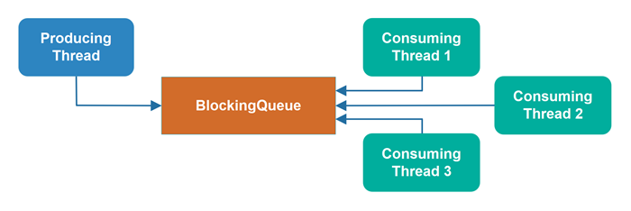
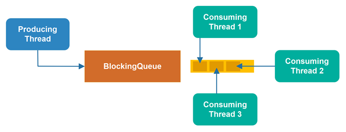
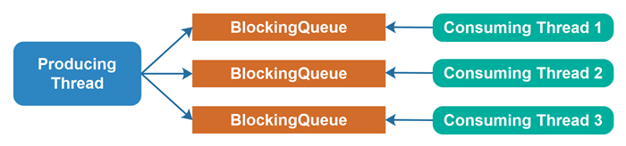

# Java中的线程拥堵

当两个或多个线程尝试同时访问相同的受保护数据结构时，可能会发生**线程拥堵**。所谓“受保护”，我是指数据结构是通过同步块或并发数据结构（锁、阻塞队列等）来保护的，以确保数据结构是线程安全的。由此产生的线程拥堵意味着尝试访问共享数据结构的线程花费了大量的时间排队等待访问数据结构 - 这浪费了宝贵的执行时间。

## 线程阻塞数据结构可能导致线程拥堵
一个阻止线程访问它的数据结构 - 这取决于其他线程当前正在访问什么 - 可能会导致线程拥堵。如果有多个线程同时访问这样的数据结构，一个或多个线程可能会排队等待访问数据结构。

这种排队在代码中是不可见的。排队发生在Java虚拟机内部。因此，线程拥堵不容易仅通过查看代码来发现。你可能需要分析工具来检测线程拥堵 - 或者，你需要学会在哪里预测线程拥堵可能会发生。

## 被阻塞的线程失去执行时间
当一个线程被阻塞尝试执行阻塞数据结构时，它不能做任何事情。因此，在被阻塞时，线程失去了可能的执行时间。线程被阻塞的时间越长，它失去的潜在执行时间就越多。

## 线程越多 - 拥堵越高
尝试访问共享阻塞数据结构的线程越多，发生线程拥堵的风险就越高，拥堵程度可能越高（等待访问数据结构的线程排队的数量）。

## 缓解线程拥堵
为了缓解线程拥堵，你必须减少同时尝试访问阻塞数据结构的线程数量。有几种方法可以做到这一点。

### 多个数据结构
缓解线程拥堵的一种方法 - 至少是围绕阻塞队列 - 是为每个消费线程提供自己的队列，并让生产线程将对象（例如任务）分配到这些阻塞队列中。
这样，每个队列只有2个线程访问：生产线程和消费线程。

### 非阻塞并发算法
另一种方法是使用非阻塞并发算法，其中访问数据结构的线程永远不会被阻塞。非阻塞并发算法和数据结构通常可以比阻塞并发算法或数据结构更少地浪费线程的潜在执行时间。

