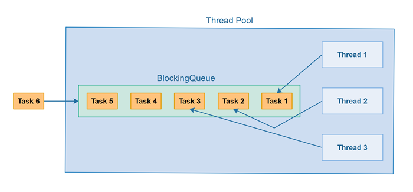

# 线程池

线程池是一组可以“重用”来执行任务的线程，这样每个线程可以执行多个任务。线程池是为每个需要执行的任务创建一个新线程的替代方案。

创建一个新线程与重用已经创建的线程相比，有性能开销。这就是为什么重用现有线程来执行任务可以比每个任务创建一个新线程获得更高的总吞吐量。

此外，使用线程池可以使控制同时活动的线程数量变得更容易。每个线程都会消耗一定量的计算机资源，如内存（RAM），因此如果你同时有太多线程活动，消耗的总资源量（例如RAM）可能会导致计算机变慢 - 例如，如果消耗了太多的RAM，操作系统（OS）开始将RAM交换到磁盘。

在本线程池教程中，我将解释线程池的工作原理、它们的用途以及如何在Java中实现线程池。请记住，Java已经包含了内置的线程池 - Java ExecutorService - 所以你可以在Java中使用线程池而不必自己实现它。然而，有时你可能想要实现自己的线程池 - 以添加ExecutorService不支持的功能。或者，你可能仅仅想作为一个学习经验来实现自己的Java线程池。

## 线程池如何工作
而不是为每个要并发执行的任务启动一个新线程，任务可以被传递给线程池。当池中有任何空闲线程时，任务就会被分配给其中之一并执行。在内部，任务被插入到一个阻塞队列中，池中的线程正在从该队列中出队。当新任务被插入到队列中时，池中的一个空闲线程将成功地出队并执行它。池中其余的空闲线程将被阻塞等待出队任务。



## 线程池使用场景
线程池通常用于多线程服务器。每个通过网络到达服务器的连接都被封装为一个任务并传递给线程池。线程池中的线程将并发处理连接上的请求。稍后将详细介绍如何在Java中实现多线程服务器。

## 内置Java线程池
Java在`java.util.concurrent`包中提供了内置的线程池，所以你不必自己实现线程池。你可以在我关于java.util.concurrent.ExecutorService的文本中阅读更多相关内容。不过，了解一下线程池的实现仍然是有用的。

## Java线程池实现
以下是一个简单的线程池实现。实现使用了Java 5中Java的标准阻塞队列。

```java
import java.util.ArrayList;
import java.util.List;
import java.util.concurrent.ArrayBlockingQueue;
import java.util.concurrent.BlockingQueue;

public class ThreadPool {

    private BlockingQueue<Runnable> taskQueue = null;
    private List<PoolThreadRunnable> runnables = new ArrayList<>();
    private volatile boolean isStopped = false;

    public ThreadPool(int noOfThreads, int maxNoOfTasks){
        taskQueue = new ArrayBlockingQueue<>(maxNoOfTasks);

        for(int i=0; i<noOfThreads; i++){
            PoolThreadRunnable poolThreadRunnable = new PoolThreadRunnable(taskQueue);
            runnables.add(poolThreadRunnable);
        }
        for(PoolThreadRunnable runnable : runnables){
            new Thread(runnable).start();
        }
    }

    public void execute(Runnable task) throws Exception{
        if(this.isStopped) throw new IllegalStateException("ThreadPool is stopped");
        this.taskQueue.offer(task);
    }

    public void stop(){
        this.isStopped = true;
        for(PoolThreadRunnable runnable : runnables){
            runnable.doStop();
        }
    }

    public void waitUntilAllTasksFinished() {
        while(this.taskQueue.size() > 0) {
            try {
                Thread.sleep(1);
            } catch (InterruptedException e) {
                e.printStackTrace();
            }
        }
    }
}

```

以下是`PoolThreadRunnable`类，它实现了`Runnable`接口，因此可以被Java线程执行：

```java
import java.util.concurrent.BlockingQueue;

public class PoolThreadRunnable implements Runnable {

    private Thread thread = null;
    private BlockingQueue<Runnable> taskQueue = null;
    private volatile boolean isStopped = false;

    public PoolThreadRunnable(BlockingQueue<Runnable> queue){
        taskQueue = queue;
    }

    public void run(){
        this.thread = Thread.currentThread();
        while(!isStopped()){
            try{
                Runnable runnable = taskQueue.take();
                runnable.run();
            } catch(Exception e){
                //记录或以其他方式报告异常，但保持线程池线程存活。
            }
        }
    }

    public void doStop(){
        isStopped = true;
        //打破线程池线程的出队调用。
        this.thread.interrupt();
    }

    public boolean isStopped(){
        return isStopped;
    }
}

```

最后，以下是一个如何使用上述`ThreadPool`的示例：

```java
public class ThreadPoolMain {

    public static void main(String[] args) throws Exception {

        ThreadPool threadPool = new ThreadPool(3, 10);

        for(int i=0; i<10; i++) {

            int taskNo = i;
            threadPool.execute( () -> {
                String message =
                        Thread.currentThread().getName()
                                + ": Task " + taskNo;
                System.out.println(message);
            });
        }

        threadPool.waitUntilAllTasksFinished();
        threadPool.stop();

    }
}

```

线程池实现由两部分组成。一个是作为线程池公共接口的`ThreadPool`类，另一个是实现执行任务的线程的`PoolThread`类。

要执行任务，将调用方法`ThreadPool.execute(Runnable r)`，并传入一个`Runnable`实现作为参数。`Runnable`在内部被入队到阻塞队列中，等待被出队。

`Runnable`将由一个空闲的`PoolThread`出队并执行。你可以在`PoolThread.run()`方法中看到这一点。执行完成后，`PoolThread`循环并尝试再次出队任务，直到被停止。

要停止`ThreadPool`，将调用方法`ThreadPool.stop()`。停止调用在内部的`isStopped`成员中被记录。然后通过调用每个线程的`doStop()`来停止池中的每个线程。注意`execute()`方法如果在`stop()`被调用后调用`execute()`将会抛出一个`IllegalStateException`。

线程将在完成它们当前正在执行的任何任务后停止。注意`PoolThread.doStop()`中的`this.interrupt()`调用。这确保了一个线程在`taskQueue.dequeue()`调用内的`wait()`调用中被阻塞时能够跳出`wait()`调用，并以抛出的`InterruptedException`离开`dequeue()`方法调用。这个异常在`PoolThread.run()`方法中被捕获、报告，然后检查`isStopped`变量。由于`isStopped`现在是true，`PoolThread.run()`将退出，线程终止。


