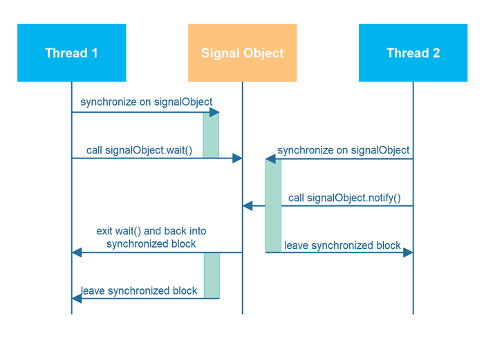

# Java线程信号机制

Java包含了一组特性，允许线程之间发送信号，并等待这些信号。例如，线程B可能等待线程A的信号，表示数据已准备好被处理。

Java中的线程信号特性是通过`wait()`、`notify()`和`notifyAll()`方法实现的，这些方法是所有Java类都扩展的Object类的一部分。

## wait()、notify() 和 notifyAll()

Java有一个内置的等待机制，允许线程在等待来自其他线程的信号时变得不活跃。java.lang.Object类定义了三个方法：wait()、notify()和notifyAll()，以促进这一点。

调用任何对象上的wait()的线程将变得不活跃，直到另一个线程在该对象上调用notify()或notifyAll()。为了调用wait()、notify()或notifyAll()，调用线程首先必须获得该对象上的锁。换句话说，调用线程必须在该对象上同步的同步块内调用wait()或notify()。

以下是一个示例类，可用于两个线程传递信号。两个线程都需要访问这个类的同一个实例。一个线程将调用`doWait()`方法，另一个线程将调用`doNotify()`。

```java
public class MonitorObject {
}

public class MyWaitNotify {
    MonitorObject myMonitorObject = new MonitorObject();

    public void doWait(){
        synchronized(myMonitorObject){
            try{
                myMonitorObject.wait();
            } catch(InterruptedException e){/*...*/}
        }
    }

    public void doNotify(){
        synchronized(myMonitorObject){
            myMonitorObject.notify();
        }
    }
}
```

当第一个线程调用`doWait()`时，它首先进入一个同步块，然后调用内部监视对象上的`wait()`。同步块是在该监视对象上同步的。当调用`wait()`时，调用线程释放了监视对象上的锁，并被阻塞，直到另一个线程在同一个监视对象上调用`notify()`或`notifyAll()`。

当第二个线程调用`doNotify()`时，它进入一个同步块，该块在内部监视对象上同步。在这个同步块内，线程随后调用监视对象上的`notify()`方法。这将唤醒一个在同一个监视对象上的`wait()`调用中被阻塞的线程。然而，这些被唤醒的线程在调用`notify()`（或`notifyAll()`）的线程释放监视对象上的锁之前，都不能退出`wait()`方法。

调用`notify()`后，第二个线程退出同步块，这使得被唤醒的线程或线程能够退出`wait()`调用并重新进入同步块，之后它们很快就退出了。

上述原理和过程如下所示。注意，图表将监视对象称为"信号对象"，意味着线程通过它发送信号。



多个线程可以在同一监视对象上调用`wait()`，因此被阻塞等待`notify()`或`notifyAll()`调用。调用`notify()`只会唤醒一个等待中的线程。调用`notifyAll()`会唤醒所有等待中的线程。

线程不能在没有持有调用方法的对象的同步锁的情况下调用wait()、notify()或notifyAll()。如果这样做了，将抛出IllegalMonitorStateException。

## 错过信号

如果调用notify()或notifyAll()时没有线程在等待，这些方法不会保存对它们的调用。如果没有线程在等待时调用了notify()，那么信号就会丢失。因此，如果一个线程在等待线程调用wait()之前调用notify()，等待线程将错过信号。这可能是也可能不是一个问题，但有时这可能导致等待线程永远等待，永远不会醒来，因为唤醒的信号被错过了。

为了避免丢失信号，应该将它们存储在信号类中。在MyWaitNotify示例中，notify信号应该存储在MyWaitNotify实例中的成员变量中。以下是对此进行修改的MyWaitNotify版本：

```java
public class MyWaitNotify2 {
    MonitorObject myMonitorObject = new MonitorObject();
    boolean wasSignalled = false;

    public void doWait(){
        synchronized(myMonitorObject){
            if(!wasSignalled){
                try{
                    myMonitorObject.wait();
                } catch(InterruptedException e){/*...*/}
            }
            //清除信号并继续运行。
            wasSignalled = false;
        }
    }

    public void doNotify(){
        synchronized(myMonitorObject){
            wasSignalled = true;
            myMonitorObject.notify();
        }
    }
}
```

注意doNotify()方法现在在调用notify()之前将wasSignalled变量设置为true。同样，注意doWait()方法现在在调用wait()之前检查wasSignalled变量。实际上，只有在前一个doWait()调用和这个之间没有收到信号时，它才调用wait()。

## 虚假唤醒

由于无法解释的原因，即使没有调用notify()和notifyAll()，线程也可能唤醒。这被称为虚假唤醒。无缘无故的唤醒。

如果MyWaitNofity2类的doWait()方法中发生了虚假唤醒，等待线程可能会在没有收到正确信号的情况下继续处理！这可能会导致您的应用程序出现严重问题。

为了防止虚假唤醒，在while循环而不是if语句中检查信号成员变量。这样的while循环也被称为自旋锁。唤醒的线程在自旋锁（while循环）中的条件变为false之前不断旋转。以下是显示这一点的MyWaitNotify2的修改版本：

```java
public class MyWaitNotify3 {
    MonitorObject myMonitorObject = new MonitorObject();
    boolean wasSignalled = false;

    public void doWait(){
        synchronized(myMonitorObject){
            while(!wasSignalled){
                try{
                    myMonitorObject.wait();
                } catch(InterruptedException e){/*...*/}
            }
            //清除信号并继续运行。
            wasSignalled = false;
        }
    }

    public void doNotify(){
        synchronized(myMonitorObject){
            wasSignalled = true;
            myMonitorObject.notify();
        }
    }
}
```

注意wait()调用现在嵌套在while循环而不是if语句中。如果等待线程在没有收到信号的情况下唤醒，wasSignalled成员仍然为false，而while循环将再次执行，导致唤醒的线程回到等待状态。

## 多个线程等待同一个信号

while循环也是解决多个线程等待问题的好方法，这些线程都使用notifyAll()被唤醒，但只有一个应该继续。一次只有一个线程能够获得监视对象上的锁，这意味着只有一个线程可以退出wait()调用并清除wasSignalled标志。然后，当这个线程退出doWait()方法中的同步块时，其他线程可以退出wait()调用并在while循环中检查wasSignalled成员变量。然而，这个标志被第一个唤醒的线程清除了，所以其余被唤醒的线程回到等待状态，直到下一个信号到达。

## 不要在常量字符串或全局对象上调用wait()

之前的文本版本有一个MyWaitNotify示例类，它使用了一个空字符串("")作为监视对象。以下是那个示例的样子：

```java
public class MyWaitNotify {
    String myMonitorObject = "";
    boolean wasSignalled = false;

    public void doWait(){
        synchronized(myMonitorObject){
            while(!wasSignalled){
                try{
                    myMonitorObject.wait();
                } catch(InterruptedException e){/*...*/}
            }
            //清除信号并继续运行。
            wasSignalled = false;
        }
    }

    public void doNotify(){
        synchronized(myMonitorObject){
            wasSignalled = true;
            myMonitorObject.notify();
        }
    }
}
```

在空字符串或任何其他常量字符串上调用wait()和notify()的问题是，JVM/编译器在内部将常量字符串转换为同一个对象。这意味着，即使你有两个不同的MyWaitNotify实例，它们都引用了同一个空字符串实例。这也意味着，在第一个MyWaitNotify实例上调用doWait()的线程可能会被第二个MyWaitNotify实例上的doNotify()调用唤醒。

这种情况在下面的图表中被描绘出来：


记住，即使4个线程在同一个共享字符串实例上调用wait()和notify()，来自doWait()和doNotify()的信号在两个MyWaitNotify实例中分别存储。在MyWaitNotify 1上的doNotify()调用可能会唤醒在MyWaitNotify 2中等待的线程，但信号只会存储在MyWaitNotify 1中。

起初，这看起来可能不是一个大问题。毕竟，如果doNotify()在第二个MyWaitNotify实例上被调用，真正可能发生的是线程A和B被错误地唤醒。这个被唤醒的线程（A或B）将在while循环中检查其信号，并因为没有在第一个MyWaitNotify实例上调用doNotify()而回到等待状态，他们正在那里等待。这种情况等同于一个被挑衅的虚假唤醒。线程A或B在没有被信号的情况下唤醒。但是代码可以处理这个，所以线程回到等待状态。

问题是，由于doNotify()调用只调用了notify()而没有调用notifyAll()，即使有4个线程在同一个字符串实例（空字符串）上等待，也只有一个线程被唤醒。所以，如果线程A或B在真正信号是为C或D时被唤醒，被唤醒的线程（A或B）将检查其信号，发现没有收到信号，并回到等待状态。C或D也没有醒来检查他们实际收到的信号，所以信号被错过了。

这种情况等同于前面描述的错过信号问题。C和D被发送了信号，但未能响应。

如果doNotify()方法调用了notifyAll()而不是notify()，所有等待的线程都被唤醒并依次检查信号。线程A和B会回到等待状态，但C或D中的一个会注意到信号并离开doWait()方法调用。C和D中的另一个会回到等待状态，因为发现信号的线程在离开doWait()时清除了它。

你可能会被诱惑总是调用notifyAll()而不是notify()，但这在性能方面是一个坏主意。没有必要唤醒所有等待的线程，当只有一个线程可以响应信号时。

所以：不要使用全局对象、字符串常量等进行wait()/notify()机制。使用一个独特的对象，用于使用它的构造。例如，每个MyWaitNotify3（来自早期部分的示例）实例都有自己的MonitorObject实例，而不是使用空字符串进行wait()/notify()调用。


