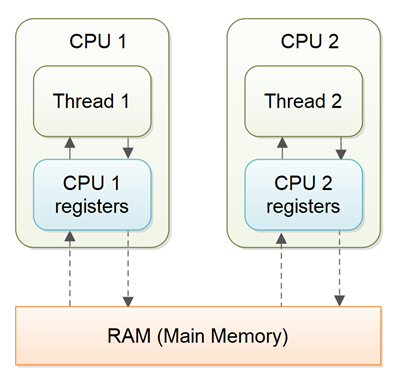
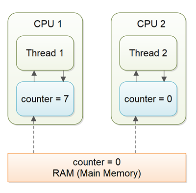

# Java volatile 关键字

Java `volatile` 关键字用于将 Java 变量标记为“存储在主内存”中。
更准确地说，这意味着对 volatile 变量的每次读取都将从计算机的主内存中读取，而不是从 CPU 寄存器，并且对 volatile 变量的每次写入都将写入主内存，而不仅仅是 CPU 寄存器。

实际上，从 Java 5 开始，`volatile` 关键字保证的不仅仅是 volatile 变量被写入和从主内存读取。我将在以下部分中解释这一点。

## 变量可见性问题

Java `volatile` 关键字保证跨线程的变量更改可见性。这可能听起来有点抽象，让我详细说明。

在一个多线程应用程序中，线程操作非 volatile 变量时，每个线程可能会出于性能原因在处理它们时将变量从主内存复制到 CPU 寄存器中。如果你的计算机包含多个 CPU，每个线程可能会在不同的 CPU 上运行。这意味着，每个线程可能将变量复制到不同 CPU 的 CPU 寄存器中。这在此处进行了说明：



对于非 volatile 变量，Java 虚拟机 (JVM) 何时将数据从主内存读取到 CPU 寄存器，或将数据从 CPU 寄存器写回主内存，没有保证。这可能引起我将在以下部分中解释的几个问题。

设想一个情况，其中两个或更多线程可以访问一个包含如下声明的计数器变量的共享对象：

```java
public class SharedObject {
    public int counter = 0;
}
```

再设想，只有线程 1 增加 `counter` 变量，但线程 1 和线程 2 都可能不时读取 `counter` 变量。

如果 `counter` 变量没有声明为 `volatile`，就没有保证何时将 `counter` 变量的值从 CPU 寄存器写回主内存。这意味着，CPU 寄存器中的 `counter` 变量值可能与主内存中的不同。这种情况在此处进行了说明：



由于另一个线程还没有将变量写回主内存，线程无法看到变量的最新值，这被称为“可见性”问题。一个线程的更新对其他线程不可见。

## Java volatile 可见性保证

Java `volatile` 关键字旨在解决变量可见性问题。
通过将 `counter` 变量声明为 `volatile`，对 `counter` 变量的所有写入将立即写回主内存。同样，对 `counter` 变量的所有读取将直接从主内存中读取。

下面是 `counter` 变量的 `volatile` 声明的样子：

```java
public class SharedObject {
    public volatile int counter = 0;
}
```

因此，将变量声明为 `volatile` 从而为其他线程的写入提供 _可见性_ 保证。

在上述场景中，一个线程（T1）修改计数器，另一个线程（T2）读取计数器（但从未修改它），声明 `counter` 变量为 `volatile` 就足以保证 T2 对 `counter` 变量写入的可见性。

然而，如果 T1 和 T2 都在增加 `counter` 变量，那么声明 `counter` 变量为 `volatile` 就不够了。稍后将对此进行更多说明。

### 完整的 volatile 可见性保证

实际上，Java `volatile` 的可见性保证超越了 `volatile` 变量本身。可见性保证如下：

- 如果线程 A 写入一个 `volatile` 变量，线程 B 随后读取同一个 `volatile` 变量，那么线程 A 在写入 `volatile` 变量之前可见的所有变量，也将在线程 B 读取 `volatile` 变量之后对线程 B 可见。

- 如果线程 A 读取一个 `volatile` 变量，然后当线程 A 读取 `volatile` 变量时可见的所有变量也将从主内存中重新读取。

让我用一个代码示例来说明这一点：

```java
public class MyClass {
    private int years;
    private int months;
    private volatile int days;

    public void update(int years, int months, int days){
        this.years  = years;
        this.months = months;
        this.days   = days;
    }
}
```

`udpate()` 方法写入了三个变量，其中只有 `days` 是 volatile。

完整的 `volatile` 可见性保证意味着，当一个值写入 `days` 时，那么写入 `days` 之前对线程可见的所有变量也将被写入主内存。这意味着，当写入 `days` 的值时，`years` 和 `months` 的值也被写入主内存。

当读取 `years`、`months` 和 `days` 的值时，可以这样操作：

```java
public class MyClass {
    private int years;
    private int months;
    private volatile int days;

    public int totalDays() {
        int total = this.days;
        total += months * 30;
        total += years * 365;
        return total;
    }

    public void update(int years, int months, int days){
        this.years  = years;
        this.months = months;
        this.days   = days;
    }
}
```

注意 `totalDays()` 方法首先将 `days` 的值读入 `total` 变量。当读取 `days` 的值时，`months` 和 `years` 的值也被读入主内存。因此，通过上述读取序列，您将保证看到 `days`、`months` 和 `years` 的最新值。

## 指令重排序挑战

Java 虚拟机和 CPU 允许出于性能原因对程序中的指令进行重排序，只要指令的语义含义保持不变。例如，看以下指令：

```java
int a = 1;
int b = 2;
a++;
b++;
```

这些指令可以重排序为以下序列，而不会丢失程序的语义含义：

```java
int a = 1;
a++;
int b = 2;
b++;
```

然而，指令重排序在其中一个变量是 `volatile` 变量时提出了挑战。
让我们看看本 Java volatile 教程前面示例中的 `MyClass` 类：

```java
public class MyClass {
    private int years;
    private int months;
    private volatile int days;

    public void update(int years, int months, int days){
        this.years  = years;
        this.months = months;
        this.days   = days;
    }
}
```

一旦 `update()` 方法向 `days` 写入一个值，`years` 和 `months` 的新写入值也会被写入主内存。
但是，如果 Java 虚拟机重排序指令，像这样：

```java
public void update(int years, int months, int days){
    this.days   = days;
    this.months = months;
    this.years  = years;
}
```

`months` 和 `years` 的值仍然在修改 `days` 变量时被写入主内存，但这次是在新值被写入 `months` 和 `years` 之前发生的。
因此，这些新值没有正确地对其他线程可见。重排序指令的语义含义已经改变。

Java 对这个问题有一个解决方案，我们将在下一节中看到。

## Java volatile Happens-Before 保证

为了解决指令重排序挑战，Java `volatile` 关键字除了可见性保证外，还提供了一个 "先行发生"（happens-before）保证。
先行发生保证保证：

- 如果读取/写入其他变量的指令原本发生在对 `volatile` 变量写入之前，那么这些读取/写入不能被重排序到对 `volatile` 变量写入之后。

写入 `volatile` 变量之前的读取/写入保证 "先行发生" 于对 `volatile` 变量的写入。
注意，仍然可能允许例如对 `volatile` 变量写入之后发生的读取/写入被重排序到对 `volatile` 变量写入之前。只是不允许反过来。

从后到前是允许的，但从前到后是不允许的。

- 如果读取/写入其他变量的指令原本发生在对 `volatile` 变量读取之后，那么这些读取/写入不能被重排序到对 `volatile` 变量读取之前。

注意，可能允许在对 `volatile` 变量读取之前发生的读取其他变量的指令被重排序到对 `volatile` 变量读取之后。只是不允许反过来。

从前往后是允许的，但从后往前是不允许的。

上述先行发生保证确保了 `volatile` 关键字的可见性保证得到执行。

## volatile 不总是足够的

即使 `volatile` 关键字保证了对 `volatile` 变量的所有读取都是直接从主内存中读取，并且对 `volatile` 变量的所有写入都是直接写入到主内存，但仍然有情况下仅声明变量为 `volatile` 是不够的。

在前面解释的情况下，只有线程 1 写入共享的 `counter` 变量，声明 `counter` 变量为 `volatile` 就足以确保线程 2 总是看到最新写入的值。

实际上，即使多个线程都在写入共享的 `volatile` 变量，并且仍然在主内存中存储正确的值，只要新写入变量的值不依赖于它的先前值。
换句话说，如果一个线程写入共享 `volatile` 变量的值不需要首先读取它的值以确定它的下一个值。

一旦线程需要首先读取 `volatile` 变量的值，然后根据该值为共享 `volatile` 变量生成一个新值，`volatile` 变量就不再足以保证正确的可见性。在读取 `volatile` 变量和写入其新值之间的短暂时间间隔，创造了一个竞态条件，多个线程可能读取 `volatile` 变量的相同值，为变量生成一个新值，并且当将值写回主内存时 - 相互覆盖各自的值。

多个线程增加同一个计数器的情况正是 `volatile` 变量不够的情况。以下部分更详细地解释了这种情况。

设想线程 1 读取一个值为 0 的共享 `counter` 变量到它的 CPU 寄存器，将其增加到 1 并且没有将改变的值写回主内存。然后线程 2 可以从主内存中读取相同的 `counter` 变量，其中变量的值仍然是 0，到它自己的 CPU 寄存器。然后线程 2 也可以将计数器增加到 1，并且也没有将其写回主内存。这种情况在下图中进行了说明：


线程 1 和线程 2 现在实际上是不同步的。共享 `counter` 变量的真实值应该是 2，但每个线程的 CPU 寄存器中变量的值为 1，而在主内存中的值仍然是 0。这是一团糟！即使线程最终将它们共享的 `counter` 变量的值写回主内存，该值也将是错误的。

## 何时 volatile 足够？

正如我前面提到的，如果两个线程都在读取和写入共享变量，那么使用 `volatile` 是不够的。你需要使用 synchronized 来保证变量的读写是原子的。读取或写入 volatile 变量不会阻塞线程的读取或写入。要实现这一点，你必须在关键部分使用 `synchronized` 关键字。

作为 `synchronized` 块的替代，你也可以使用 `java.util.concurrent` 包中发现的许多原子数据类型。例如，`AtomicLong` 或 `AtomicReference` 或其他之一。

如果只有一个线程读取和写入 volatile 变量的值，而其他线程只读取该变量，那么读取线程保证能看到写入 volatile 变量的最新值。如果不将变量设为 volatile，这一点将无法保证。

`volatile` 关键字保证对 32 位和 64 位变量起作用。

## volatile 的性能考虑

读取和写入 volatile 变量会导致变量被读取或写入到主内存。从主内存读取和写入比访问 CPU 寄存器更昂贵。访问 volatile 变量还防止了指令重排序，这是通常的性能增强技术。因此，只有在你真的需要强制变量的可见性时才使用 volatile 变量。

在实践中，CPU 寄存器值通常只是写入 CPU L1 缓存，这是相当快的。
不像写入 CPU 寄存器那样快，但仍然很快。从 L1 缓存同步到 L2 和 L3 缓存再回到主内存（RAM）是由 CPU 之外的独立芯片完成的（据我了解），所以 CPU 不会因此而负担过重。

即便如此，只有在真正需要时才使用 volatile 变量。这也将迫使你详细了解 Java volatile 变量是如何工作的！


