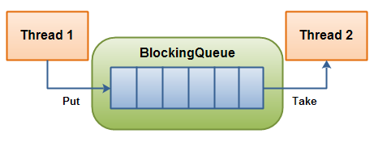

# Java BlockingQueue

_Java BlockingQueue_ 接口，`java.util.concurrent.BlockingQueue`，表示一个线程安全的队列，可以往其中放入元素，也可以从中取出元素。换句话说，多个线程可以并发地向 Java `BlockingQueue` 插入和取出元素，而不会产生任何并发问题。

术语 _blocking queue_ 来自 Java `BlockingQueue` 能够阻塞尝试从队列中插入或取出元素的线程的事实。例如，如果一个线程尝试取出一个元素，而队列中没有剩余元素，该线程可以被阻塞，直到有元素可供取出。调用线程是否被阻塞取决于你对 `BlockingQueue` 调用了哪些方法。后面将更详细地解释不同的方法。

本文不会讨论如何在 Java 中自己实现 `BlockingQueue`。如果对此感兴趣，在我的更理论化的 Java 并发教程中有关于阻塞队列的文本。

## BlockingQueue 实现
由于 `BlockingQueue` 是一个接口，你需要使用它的一个实现来使用它。
`java.util.concurrent` 包有以下 `BlockingQueue` 接口的实现：

- ArrayBlockingQueue
- DelayQueue
- LinkedBlockingQueue
- LinkedBlockingDeque
- LinkedTransferQueue
- PriorityBlockingQueue
- SynchronousQueue

点击列表中的链接以了解更多关于每种实现的信息。

## BlockingQueue 使用
`BlockingQueue` 通常用于一个线程生产对象，另一个线程消费这些对象。下图阐释了这一原则：
| | 
|---|
|  |
| **一个线程向其中放入元素，另一个线程从中取出元素的 BlockingQueue。**|

生产线程将不断生产新对象并将其插入 `BlockingQueue`，直到队列达到它所能容纳的上限。换句话说，就是它的限制。如果阻塞队列达到其上限，生产线程在尝试插入新对象时会被阻塞。它将一直保持阻塞状态，直到消费线程从队列中取出一个对象。

消费线程不断地从 `BlockingQueue` 中取出对象进行处理。如果消费线程尝试从空队列中取出一个对象，消费线程将被阻塞，直到生产线程将对象放入队列。

### BlockingQueue 方法
Java `BlockingQueue` 接口有 4 组不同的方法用于插入、移除和检查队列中的元素。如果请求的操作不能立即执行，每组方法的行为各不相同。以下是方法表：

| | **抛出异常** | **特殊值** | **阻塞** | **超时** |
|---|---|---|---|---|
| **插入** | `add(o)` | `offer(o)` | `put(o)` | `offer(o, timeout, timeunit)` |
| **移除** | `remove(o)` | `poll()` | `take()` | `poll(timeout, timeunit)` |
| **检查** | `element()` | `peek()` |  |  |

4 组不同的行为方式表示：

1. **抛出异常**：
   如果尝试的操作不能立即执行，则抛出异常。
2. **特殊值**：
   如果尝试的操作不能立即执行，则返回一个特殊值（通常是 true / false）。
3. **阻塞**：
   如果尝试的操作不能立即执行，则方法调用将阻塞，直到可以执行。
4. **超时**：
   如果尝试的操作不能立即执行，则方法调用将阻塞，但不会等待超过给定的超时时间。返回一个特殊值，指示操作是否成功（通常是 true / false）。

无法向 `BlockingQueue` 插入 `null`。如果尝试插入 null，`BlockingQueue` 将抛出 `NullPointerException`。

还可以访问 `BlockingQueue` 内的所有元素，而不仅仅是队列开头和结尾的元素。例如，假设你已经排队了一个待处理的对象，但你的应用程序决定取消它。然后你可以调用 `remove(o)` 来从队列中移除特定的对象。然而，这不是非常高效的操作，所以除非你真的需要，否则不要使用这些 `Collection` 方法。

## Java BlockingQueue 示例
以下是一个 Java `BlockingQueue` 示例。示例使用 `ArrayBlockingQueue` 实现了 `BlockingQueue` 接口。

首先，`BlockingQueueExample` 类在单独的线程中启动了一个 `Producer` 和一个 `Consumer`。`Producer` 向共享的 `BlockingQueue` 中插入字符串，`Consumer` 将它们取出。

```java
public class BlockingQueueExample {
    public static void main(String[] args) throws Exception {

        BlockingQueue<String> queue = new ArrayBlockingQueue<>(1024);

        Producer producer = new Producer(queue);
        Consumer consumer = new Consumer(queue);

        new Thread(producer).start();
        new Thread(consumer).start();

        Thread.sleep(4000);
    }
}
```

以下是 `Producer` 类。注意它在每个 `put()` 调用之间休眠一秒钟。这将导致 `Consumer` 在等待队列中的对象时阻塞。

```java
public class Producer implements Runnable {
    protected BlockingQueue<String> queue = null;

    public Producer(BlockingQueue<String> queue) {
        this.queue = queue;
    }

    public void run() {
        try {
            queue.put("1");
            Thread.sleep(1000);
            queue.put("2");
            Thread.sleep(1000);
            queue.put("3");
        } catch (InterruptedException e) {
            e.printStackTrace();
        }
    }
}
```

以下是 `Consumer` 类。它只是从队列中取出对象，并将它们打印到 `System.out`。

```java
public class Consumer implements Runnable {
    protected BlockingQueue<String> queue = null;

    public Consumer(BlockingQueue<String> queue) {
        this.queue = queue;
    }

    public void run() {
        try {
            System.out.println(queue.take());
            System.out.println(queue.take());
            System.out.println(queue.take());
        } catch (InterruptedException e) {
            e.printStackTrace();
        }
    }
}
```

## add()
Java BlockingQueue `add()` 方法将在 BlockingQueue 内部有空间时将作为参数传递的元素添加到此方法中。如果 BlockingQueue 内部没有空间容纳这个新元素，`add()` 方法将抛出 IllegalStateException。

## offer()
BlockingQueue `offer()` 方法将在 BlockingQueue 内部有空间时将作为参数传递的元素添加到此方法中。如果 BlockingQueue 内部没有空间容纳这个新元素，`offer()` 方法返回 `false`。

## offer(long millis, TimeUnit timeUnit)
存在一个带有超时参数的 `offer()` 方法版本。这个版本的 `offer()` 方法将在 BlockingQueue 内部有空间时将作为参数传递的元素添加进去，或者直到空间变得可用。如果 BlockingQueue 在超时时间内没有或不能获得空间来容纳这个新元素，这个版本的 `offer()` 方法返回 `false`。

## put()
BlockingQueue `put()` 方法将元素插入 BlockingQueue，如果它内部有空间。如果 BlockingQueue 没有空间容纳新元素，`put()` 方法将阻塞调用 `put()` 方法的线程，直到 BlockingQueue 内部有空间容纳新元素。

## take()
Java BlockingQueue `take()` 方法将移除 BlockingQueue 中的第一个元素。
如果 BlockingQueue 不包含任何元素，`take()` 方法将阻塞调用 `take()` 的线程，直到有元素被插入到 BlockingQueue 中。

## poll()
BlockingQueue `poll()` 方法将移除 BlockingQueue 中的第一个元素。
如果 BlockingQueue 不包含任何元素，`poll()` 方法将返回 `null`。

## poll(long timeMillis, TimeUnit timeUnit)
BlockingQueue `poll(long timeMillis, TimeUnit timeUnit)` 方法将移除 BlockingQueue 中的第一个元素。
如果 BlockingQueue 不包含任何元素，这个版本的 `poll()` 方法将等待给定的超时时间，直到有一个元素变得可用。如果在给定的超时期间没有元素变得可用，此方法返回 `null`。

## remove(Object o)
BlockingQueue `remove(Object o)` 方法将从 BlockingQueue 中移除给定元素的单个实例，如果该元素存在于 BlockingQueue 中。`remove()` 方法将使用 `o.equals(element)` 来决定作为参数传递的对象 o 是否与 BlockingQueue 中的给定元素匹配。如果 BlockingQueue 包含多个与给定 o 参数匹配的元素，只会从 BlockingQueue 中移除其中一个元素。`remove()` 方法在移除一个元素时返回 `true`，如果没有移除元素则返回 `false`。

## peek()
BlockingQueue `peek()` 方法将返回 BlockingQueue 的第一个元素，而不会移除它。
如果 BlockingQueue 不包含任何元素，`peek()` 方法将返回 `null`。

## element()
BlockingQueue `element()` 方法将返回 BlockingQueue 的第一个元素，而不会移除它。
如果 BlockingQueue 不包含任何元素，`element()` 方法将抛出 NoSuchElementException。

## contains(Object o)
BlockingQueue `contains(Object o)` 方法将返回 `true` 如果 BlockingQueue 包含一个与 `contains()` 方法的参数对象匹配的对象。使用 `Objects.equals(o, element)` 语句来检查参数对象 o 是否与 BlockingQueue 中的给定元素匹配。如果找到匹配参数对象的元素，此方法返回 `true`。如果没有找到匹配的元素，则返回 `false`。

## drainTo(Collection dest)
`drainTo(Collection dest)` 方法将 BlockingQueue 中的所有元素排空到给定的目标 Collection 中。

## drainTo(Collection dest, int maxElements)
`drainTo(Collection dest, int maxElements)` 从 BlockingQueue 中排空最多 `maxElements` 个元素到目标 Collection 中。

## size()
BlockingQueue `size()` 方法返回 BlockingQueue 中存储的元素数量。

## remainingCapacity
BlockingQueue `remainingCapacity()` 方法返回 BlockingQueue 的剩余（未使用）容量。剩余容量是计算为满容量减去 BlockingQueue 中存储的元素数量。


