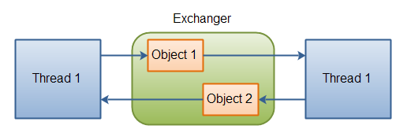

# Exchanger

`java.util.concurrent.Exchanger` 类表示一种会合点，在这里两个线程可以交换对象。以下是这种机制的图示：

|  |
| --- |
|  |
| **两个线程通过 Exchanger 交换对象。** |

对象交换是通过两个 `exchange()` 方法之一来完成的。以下是示例代码：

```java
Exchanger exchanger = new Exchanger();

ExchangerRunnable exchangerRunnable1 =
        new ExchangerRunnable(exchanger, "A");

ExchangerRunnable exchangerRunnable2 =
        new ExchangerRunnable(exchanger, "B");

new Thread(exchangerRunnable1).start();
new Thread(exchangerRunnable2).start();
```

以下是 `ExchangerRunnable` 代码：

```java
public class ExchangerRunnable implements Runnable {

    Exchanger exchanger = null;
    Object    object    = null;

    public ExchangerRunnable(Exchanger exchanger, Object object) {
        this.exchanger = exchanger;
        this.object = object;
    }

    public void run() {
        try {
            Object previous = this.object;

            this.object = this.exchanger.exchange(this.object);

            System.out.println(
                    Thread.currentThread().getName() +
                    " exchanged " + previous + " for " + this.object
            );
        } catch (InterruptedException e) {
            e.printStackTrace();
        }
    }
}
```

这个示例将打印出以下内容：

```
Thread-0 exchanged A for B
Thread-1 exchanged B for A
```


