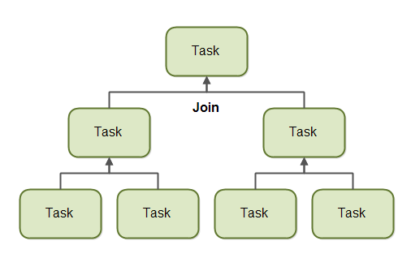

# Java ForkJoinPool

Java 7 中新增了 Java ForkJoinPool。ForkJoinPool 类似于 Java ExecutorService，但有一个不同之处：Java ForkJoinPool 使任务能够轻松地将自己的工作分解成更小的任务，然后将这些子任务提交到 ForkJoinPool。只要进一步细分任务有意义，任务可以不断地将自己的工作分解成更小的子任务。这可能听起来有点抽象，因此在本分叉和合并教程中，我将解释 Java `ForkJoinPool` 如何工作，以及如何分解任务。


## Fork 和 Join 原理解释

在我们查看 `ForkJoinPool` 之前，我想先解释一下分叉和合并原则通常如何工作。

分叉和合并原则由两个递归执行的步骤组成：分叉步骤和合并步骤。

### Fork

使用分叉和合并原则的任务可以将自己的工作 _分叉_（分解）成可以并发执行的更小的子任务。这在下面的图表中进行了说明：


通过将工作分解成子任务，每个子任务可以由不同的 CPU 或同一 CPU 上的不同线程并行执行。

只有当任务被分配的工作量足够大，以至于这样做有意义时，任务才会将自己分解成子任务。将任务分解成子任务有一定的开销，所以对于少量工作，这种开销可能大于通过并发执行子任务所获得的加速。

决定将任务分叉成子任务的合理性的界限也称为阈值。每个任务需要自行决定一个合理的阈值。这在很大程度上取决于正在进行的工作类型。

### Join

当任务将自身分解成子任务后，任务会等待其子任务完成执行。

一旦子任务完成执行，任务可能会将所有结果 _合并_（合并）为一个结果。这在下面的图表中进行了说明：



当然，并非所有类型任务都可能返回结果。如果任务不返回结果，那么任务只需等待其子任务完成。那时不会发生结果合并。

## Java ForkJoinPool

Java ForkJoinPool 是一个特殊的线程池，它被设计为与分叉和合并任务分解很好地配合工作。
`ForkJoinPool` 类位于 `java.util.concurrent` 包中，因此完整的类名是 `java.util.concurrent.ForkJoinPool`。

### 创建 ForkJoinPool

你可以使用两种方式创建 Java ForkJoinPool。一种是通过 ForkJoinPool 构造函数，另一种是通过 ForkJoinPool 类中的静态工厂方法。

让我们首先看看如何使用其构造函数创建 Java `ForkJoinPool`。你将所需的并行级别作为参数传递给 `ForkJoinPool` 构造函数。并行级别指示你希望有多少线程或 CPU 同时在提交给 `ForkJoinPool` 的任务上工作。以下是一个 Java `ForkJoinPool` 创建示例：

```java
ForkJoinPool forkJoinPool = new ForkJoinPool(4);
```

这个示例创建了一个并行级别为 4 的 `ForkJoinPool`。

你也可以使用静态工厂方法 ForkJoinPool.commonPool()。这将返回共享的 ForkJoinPool 实例。这个公共的 ForkJoinPool 将根据提交给它的工作负载内部定义并行级别（据我了解）。

如果你需要在应用程序的多个地方使用 ForkJoinPool 实例，最好只使用共享的公共 ForkJoinPool，而不是创建自己的。这样，你可能比创建多个 ForkJoinPool 实例并尝试将它们的并行级别与底层硬件相匹配更好地共享底层硬件。

以下是如何使用静态工厂方法 `commonPool()` 创建 Java ForkJoinPool：

```java
ForkJoinPool forkJoinPool = ForkJoinPool.commonPool();
```

### 向 ForkJoinPool 提交任务

你向 `ForkJoinPool` 提交任务的方式与向 `ExecutorService` 提交任务类似。
你可以提交两种类型的任务。一种是不返回任何结果的任务（一个“动作”），另一种是返回结果的任务（一个“任务”）。这两种类型的任务分别由 `RecursiveAction` 和 `RecursiveTask` 类表示。如何使用这两种任务以及如何提交它们将在以下部分中介绍。

顺便说一下，RecursiveAction 和 RecursiveTask 类都是 ForkJoinTask 类的子类。

## RecursiveAction

`RecursiveAction` 是一个不返回任何值的任务。它只是执行一些工作，例如将数据写入磁盘，然后退出。

`RecursiveAction` 可能仍然需要将其工作分解成可以由独立线程或 CPU 执行的更小的工作块。

你通过扩展它来实现 `RecursiveAction`。以下是一个 `RecursiveAction` 示例：

```java
import java.util.concurrent.RecursiveAction;

public class MyRecursiveAction extends RecursiveAction {

  private long workLoad = 0;

  public MyRecursiveAction(long workLoad) {
    this.workLoad = workLoad;
  }

  @Override
  protected void compute() {
    // 如果工作量超过阈值，将任务分解成更小的任务
    if (this.workLoad > 16) {
      System.out.println("Splitting workLoad : " + this.workLoad);

      long workload1 = this.workLoad / 2;
      long workload2 = this.workLoad - workload1;

      MyRecursiveAction subtask1 = new MyRecursiveAction(workload1);
      MyRecursiveAction subtask2 = new MyRecursiveAction(workload2);

      subtask1.fork();
      subtask2.fork();
    } else {
      System.out.println("Doing workLoad myself: " + this.workLoad);
    }
  }
}
```

这个示例非常简化。`MyRecursiveAction` 简单地将虚构的 `workLoad` 作为参数传递给它的构造函数。如果 `workLoad` 超过某个阈值，工作将被分解成子任务，这些子任务也被安排执行（通过子任务的 `.fork()` 方法）。
如果 `workLoad` 低于某个阈值，则工作由 `MyRecursiveAction` 本身执行。

你可以使用 Java ForkJoinPool 这样安排 `MyRecursiveAction` 的执行：

```java
MyRecursiveAction myRecursiveAction = new MyRecursiveAction(24);

forkJoinPool.invoke(myRecursiveAction);
```

## RecursiveTask

`RecursiveTask` 是一个返回结果的任务。它可以将自己的工作分解成更小的任务，并将这些子任务的结果合并成一个集体结果。分解和合并可能发生在几个层次上。以下是一个 `RecursiveTask` 示例：

```java
import java.util.concurrent.RecursiveTask;

public class MyRecursiveTask extends RecursiveTask<Long> {

  private long workLoad = 0;

  public MyRecursiveTask(long workLoad) {
    this.workLoad = workLoad;
  }

  protected Long compute() {

    // 如果工作量超过阈值，将任务分解成更小的任务
    if (this.workLoad > 16) {
      System.out.println("Splitting workLoad : " + this.workLoad);

      long workload1 = this.workLoad / 2;
      long workload2 = this.workLoad - workload1;

      MyRecursiveTask subtask1 = new MyRecursiveTask(workload1);
      MyRecursiveTask subtask2 = new MyRecursiveTask(workload2);

      subtask1.fork();
      subtask2.fork();

      long result = 0;
      result += subtask1.join();
      result += subtask2.join();
      return result;

    } else {
      System.out.println("Doing workLoad myself: " + this.workLoad);
      return workLoad * 3;
    }
  }
}
```

这个示例类似于 `RecursiveAction` 示例，除了它返回一个结果。`MyRecursiveTask` 类扩展了 `RecursiveTask<Long>`，这意味着任务返回的结果是一个 `Long`。

`MyRecursiveTask` 示例还将工作分解成子任务，并使用每个子任务的 `fork()` 方法安排这些子任务执行。

此外，此示例然后通过调用每个子任务的 `join()` 方法来接收子任务返回的结果。子任务结果被合并成一个更大的结果，然后返回。这种子任务结果的合并/合并可能在几个递归级别上递归发生。

你可以这样安排 `RecursiveTask`：

```java
MyRecursiveTask myRecursiveTask = new MyRecursiveTask(128);

long mergedResult = forkJoinPool.invoke(myRecursiveTask);

System.out.println("mergedResult = " + mergedResult);
```

注意如何从 `ForkJoinPool.invoke()` 方法调用中获取最终结果。


